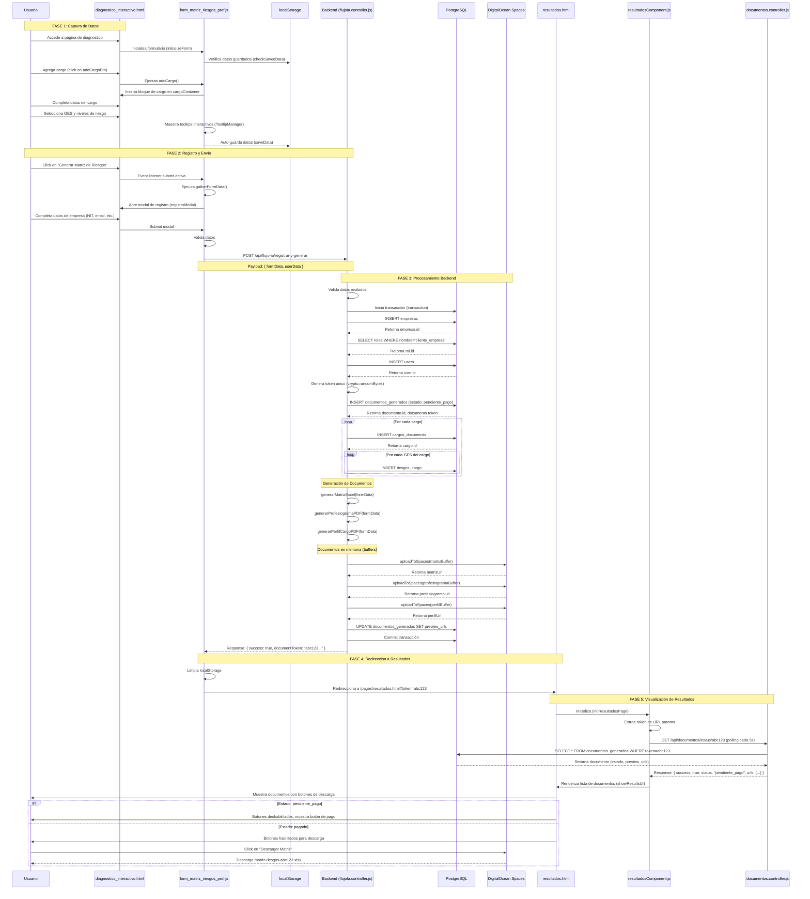
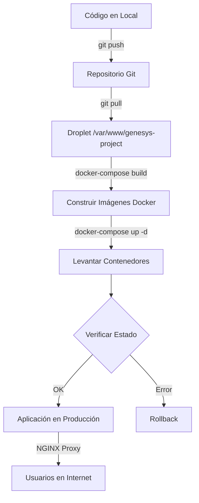

# DIAGNÓSTICO DE ARQUITECTURA: PROFESIOGRAMA Y MATRIZ DE RIESGOS

**Fecha de Análisis:** 2025-10-26
**Sistema:** Genesys Laboral Medicine - Módulo de Diagnóstico Interactivo
**Analista:** Claude Code (Agente de Ingeniería de Software)

---

## 1. RESUMEN EJECUTIVO DEL FLUJO

El módulo de "Profesiograma y Matriz de Riesgos" es un sistema integral que permite a las empresas crear una cuenta, ingresar información sobre sus cargos y riesgos laborales, y generar automáticamente documentos de cumplimiento SST (Seguridad y Salud en el Trabajo) conforme a la Resolución 1843.

### Flujo de Alto Nivel

```
Usuario completa formulario → Modal de registro → Backend crea cuenta y documentos
→ Genera PDFs/Excel → Sube a Cloud Storage → Retorna token → Página de resultados
→ Polling de estado → Descarga de documentos
```

### Tecnologías Clave
- **Frontend:** Vanilla JavaScript, localStorage para persistencia temporal
- **Backend:** Node.js con Express, PostgreSQL con Knex.js
- **Procesamiento:** ExcelJS para matrices, PDFKit para documentos PDF
- **Storage:** DigitalOcean Spaces (S3-compatible)
- **Arquitectura:** Multi-página con componentes modulares

---

## 2. IDENTIFICACIÓN DE ARCHIVOS Y RESPONSABILIDADES

### 2.1 Frontend - Interfaz HTML

#### **diagnostico_interactivo.html**
**Ruta:** `client/public/pages/diagnostico_interactivo.html`

**Elementos Clave del DOM:**

| ID/Selector | Tipo | Propósito | Línea |
|-------------|------|-----------|-------|
| `matrizRiesgosForm` | `<form>` | Formulario principal que contiene todos los cargos | 819 |
| `cargoContainer` | `<div>` | Contenedor dinámico donde se insertan los bloques de cargo | 820 |
| `addCargoBtn` | `<button>` | Botón para agregar nuevos cargos al formulario | 830 |
| `btnReactivarTutorial` | `<button>` | Botón para mostrar tutorial inicial | 826 |
| `registroModal` | `<div>` | Modal para capturar datos de registro del usuario/empresa | 971 |

**Campos del Formulario de Cargo (dinámicos):**
- `cargoName` - Nombre del cargo
- `area` - Área/proceso al que pertenece
- `zona` - Zona o lugar físico de trabajo
- `numTrabajadores` - Número de trabajadores en el cargo
- `descripcionTareas` - Descripción detallada de las tareas
- `tareasRutinarias` - Checkbox: ¿Las tareas son rutinarias?
- `manipulaAlimentos` - Checkbox
- `trabajaAlturas` - Checkbox
- `trabajaEspaciosConfinados` - Checkbox
- `conduceVehiculo` - Checkbox
- `ges_cargo_*` - Checkboxes dinámicos para selección de GES (Grupos de Exposición Similar)

**Campos del Modal de Registro (`registroModal`):**

| ID | Campo | Línea |
|-----|-------|-------|
| `modalNombreEmpresa` | Nombre de la Empresa | 982 |
| `modalNit` | NIT de la Empresa | 987 |
| `modalEmail` | Email del usuario | 992 |
| `modalPassword` | Contraseña | 997 |
| `modalNombreContacto` | Nombre del contacto (opcional) | 1002 |

**Evento Disparador Principal:**
- **Evento:** `submit` en el formulario `matrizRiesgosForm`
- **Acción:** Abre el modal de registro, guarda datos del formulario temporalmente

---

#### **resultados.html**
**Ruta:** `client/public/pages/resultados.html`

**Elementos Clave del DOM:**

| ID | Propósito | Línea |
|----|-----------|-------|
| `loader-container` | Contenedor del spinner de carga mientras se procesan documentos | 812 |
| `results-container` | Contenedor que muestra los resultados cuando están listos | 820 |
| `error-container` | Contenedor de mensajes de error | 840 |
| `.document-list` | Lista `<ul>` donde se insertan los botones de descarga dinámicamente | 827 |
| `error-message` | Elemento `<p>` para mostrar mensajes de error específicos | 844 |

**Estados de la Página:**
1. **Cargando:** `loader-container` visible, otros ocultos
2. **Éxito:** `results-container` visible con lista de documentos
3. **Error:** `error-container` visible con mensaje de error

---

### 2.2 Frontend - Lógica JavaScript

#### **form_matriz_riesgos_prof.js**
**Ruta:** `client/src/js/components/form_matriz_riesgos_prof.js`

**Función Principal:** `initializeForm()`
**Línea de inicio:** 304

**Responsabilidades Clave:**

1. **Gestión del DOM y Event Listeners**
   - Inicializa referencias a elementos DOM (líneas 305-308)
   - Configura event listeners para agregar cargos, submit del formulario

2. **Sistema de Tooltips Interactivos**
   - Clase `TooltipManager` (líneas 7-193) proporciona ayuda contextual para niveles de riesgo
   - Tooltips para Deficiencia, Exposición y Consecuencia con ejemplos y guías

3. **Persistencia Local de Datos**
   - Usa `localStorage` para guardar el estado del formulario (clave: `matrizRiesgosData`)
   - Función `saveData()` guarda automáticamente los datos
   - Función `checkSavedData()` (línea 586) verifica datos guardados al cargar la página
   - **Expiración:** Los datos persisten por 72 horas, después se limpian automáticamente

4. **Recolección de Datos del Formulario**
   - **Función Central:** `gatherFormData()` (línea 407)
   - **Retorno:** Objeto con estructura:
     ```javascript
     {
       cargos: [
         {
           cargoName: string,
           area: string,
           zona: string,
           numTrabajadores: number,
           descripcionTareas: string,
           tareasRutinarias: boolean,
           manipulaAlimentos: boolean,
           trabajaAlturas: boolean,
           trabajaEspaciosConfinados: boolean,
           conduceVehiculo: boolean,
           gesSeleccionados: [
             {
               riesgo: string,        // Ej: "Físico"
               ges: string,          // Ej: "Ruido"
               controles: {
                 fuente: string,
                 medio: string,
                 individuo: string
               },
               niveles: {
                 deficiencia: { value: number, label: string },
                 exposicion: { value: number, label: string },
                 consecuencia: { value: number, label: string }
               }
             }
           ]
         }
       ]
     }
     ```

5. **Gestión de Cargos Dinámicos**
   - Función `addCargo()` crea nuevos bloques de cargo en el DOM
   - Cada cargo tiene su propio set de inputs para riesgos (GES)
   - Sistema de autocompletado con `<datalist>` para valores históricos

6. **Cálculo de Niveles de Riesgo**
   - Sistema de barras interactivas para seleccionar niveles de Deficiencia, Exposición y Consecuencia
   - Valores numéricos predefinidos según metodología GTC 45:
     - **Deficiencia:** 0 (N/A), 2 (Bajo), 6 (Medio), 10 (Alto/Muy Alto)
     - **Exposición:** 1 (Esporádica), 2 (Ocasional), 3 (Frecuente), 4 (Continua)
     - **Consecuencia:** 10 (Leve), 25 (Grave), 60 (Muy Grave), 100 (Mortal)

---

#### **resultadosComponent.js**
**Ruta:** `client/src/js/components/resultadosComponent.js`

**Función Principal:** `initResultadosPage()`
**Línea de inicio:** 3

**Responsabilidades:**

1. **Obtención del Token de URL**
   ```javascript
   const params = new URLSearchParams(window.location.search);
   const token = params.get('token');
   ```
   - Línea 48-49

2. **Polling de Estado de Documentos**
   - **Función:** `checkDocumentStatus()` (línea 167)
   - **Frecuencia:** Cada 5 segundos (línea 215)
   - **Endpoint consultado:** `GET /api/documentos/status/:token`
   - **Estados posibles:**
     - `pendiente_pago` - Documentos generados, esperando pago
     - `pagado` / `completed` - Documentos listos para descarga
     - `failed` - Error en generación

3. **Renderizado de Resultados**
   - **Función:** `showResultsUI(data)` (línea 69)
   - Muestra lista de documentos disponibles:
     - Matriz de Riesgos (Excel)
     - Profesiograma (PDF)
     - Perfil de Cargo (PDF)
   - Habilita/deshabilita botones de descarga según estado de pago

4. **Manejo de Errores**
   - **Función:** `showError(message)` (línea 138)
   - Muestra mensajes de error al usuario si falla la consulta o generación

---

### 2.3 Backend - Controladores

#### **flujoIa.controller.js**
**Ruta:** `server/src/controllers/flujoIa.controller.js`

**Función Principal:** `registrarYGenerar(req, res)`
**Línea de inicio:** 14

**Responsabilidad:** Controlador maestro que orquesta todo el flujo de registro y generación de documentos.

**Flujo de Ejecución (paso a paso):**

```javascript
// 1. Validación de datos (líneas 21-26)
if (!formData || !userData || !userData.email) {
  return res.status(400).json({ success: false, message: 'Faltan datos requeridos.' });
}

// 2. Inicio de transacción de BD (línea 31)
trx = await db.transaction();

// 3. Hasheo de contraseña (líneas 33-34)
const salt = await bcrypt.genSalt(10);
const passwordHash = await bcrypt.hash(userData.password, salt);

// 4. Creación de Empresa (líneas 37-42)
const [empresa] = await trx('empresas').insert({
  nombre_legal: userData.nombreEmpresa,
  nit: userData.nit,
  password_hash: passwordHash
}).returning('*');

// 5. Búsqueda de rol 'cliente_empresa' (líneas 45-48)
const rolCliente = await trx('roles').where({ nombre: 'cliente_empresa' }).first();

// 6. Creación de Usuario (líneas 55-61)
const [user] = await trx('users').insert({
  email: userData.email,
  full_name: userData.nombre || userData.email,
  password_hash: passwordHash,
  rol_id: rolClienteId,
  empresa_id: empresa.id
}).returning('*');

// 7. Generación de token único (líneas 65-66)
const documentToken = crypto.randomBytes(32).toString('hex');

// 8. Creación de Documento (líneas 68-76)
const [documento] = await trx('documentos_generados').insert({
  empresa_id: empresa.id,
  usuario_lead_id: user.id,
  tipo_documento: 'paquete_inicial',
  form_data: JSON.stringify(formData),
  estado: 'pendiente_pago',
  token: documentToken,
  preview_urls: '{}'
}).returning('*');

// 9. Guardado de Cargos y Riesgos (líneas 81-113)
for (const cargo of formData.cargos) {
  const [cargoDB] = await trx('cargos_documento').insert({
    documento_id: documento.id,
    nombre_cargo: cargo.cargoName,
    area: cargo.area,
    // ... otros campos
  }).returning('*');

  for (const ges of cargo.gesSeleccionados) {
    await trx('riesgos_cargo').insert({
      cargo_id: cargoDB.id,
      tipo_riesgo: ges.riesgo,
      descripcion_riesgo: ges.ges,
      nivel_deficiencia: ges.niveles?.deficiencia?.value,
      nivel_exposicion: ges.niveles?.exposicion?.value,
      nivel_consecuencia: ges.niveles?.consecuencia?.value,
      controles_fuente: ges.controles?.fuente,
      controles_medio: ges.controles?.medio,
      controles_individuo: ges.controles?.individuo
    });
  }
}

// 10. Generación de Documentos en Memoria (líneas 125-132)
const [matrizBuffer, profesiogramaBuffer, perfilBuffer] = await Promise.all([
  generarMatrizExcel(formData, { companyName: empresa.nombre_legal }),
  generarProfesiogramaPDF(formData, { companyName: empresa.nombre_legal }),
  generarPerfilCargoPDF(formData, { companyName: empresa.nombre_legal })
]);

// 11. Subida a DigitalOcean Spaces (líneas 140-159)
const [matrizUrl, profesiogramaUrl, perfilUrl] = await Promise.all([
  uploadToSpaces(matrizBuffer, `matriz-riesgos-${documentToken}.xlsx`, 'application/vnd.openxmlformats-officedocument.spreadsheetml.sheet'),
  uploadToSpaces(profesiogramaBuffer, `profesiograma-${documentToken}.pdf`, 'application/pdf'),
  uploadToSpaces(perfilBuffer, `perfil-cargo-${documentToken}.pdf`, 'application/pdf')
]);

// 12. Actualización de URLs en BD (líneas 170-176)
await trx('documentos_generados')
  .where({ id: documento.id })
  .update({
    preview_urls: JSON.stringify({
      matriz: matrizUrl,
      profesiograma: profesiogramaUrl,
      perfil: perfilUrl
    })
  });

// 13. Commit de transacción (línea 182)
await trx.commit();

// 14. Respuesta al cliente (líneas 185-189)
res.status(201).json({
  success: true,
  message: '¡Cuenta creada y documentos generados! Redirigiendo...',
  documentToken: documentToken
});
```

**Manejo de Errores:**
- Rollback automático de transacción en caso de error (líneas 193-195)
- Detección de errores de unicidad (líneas 200-211):
  - Email duplicado (código PostgreSQL 23505, constraint `users_email_unique`)
  - NIT duplicado (constraint `empresas_nit_unique`)
  - Token duplicado (constraint `documentos_generados_token_unique`)

---

#### **documentos.controller.js**
**Ruta:** `server/src/controllers/documentos.controller.js`

**Función:** `getDocumentStatus(req, res)`
**Línea de inicio:** 4

**Responsabilidad:** Consultar el estado de generación de documentos.

```javascript
// 1. Extracción de token (línea 5)
const { token } = req.params;

// 2. Consulta a BD (línea 12)
const documento = await db('documentos_generados').where({ token }).first();

// 3. Procesamiento de URLs (líneas 22-35)
let urls = {};
if (documento.preview_urls && typeof documento.preview_urls === 'object') {
  urls = documento.preview_urls;
} else if (typeof documento.preview_urls === 'string') {
  urls = JSON.parse(documento.preview_urls || '{}');
}

// 4. Respuesta (líneas 39-43)
res.status(200).json({
  success: true,
  status: documento.estado,
  urls: urls
});
```

---

#### **matriz-riesgos.controller.js**
**Ruta:** `server/src/controllers/matriz-riesgos.controller.js`

**Función:** `generarMatrizExcel(datosFormulario, { companyName })`
**Línea de inicio:** 10

**Responsabilidad:** Generar archivo Excel de Matriz de Riesgos según GTC 45.

**Columnas del Excel Generado (29 columnas totales):**

| # | Columna | Key | Descripción |
|---|---------|-----|-------------|
| 1 | Proceso | `proceso` | Área o proceso (ej: "Producción") |
| 2 | Zona/Lugar | `zona_lugar` | Ubicación física del trabajo |
| 3 | Actividades | `actividades` | Nombre del cargo |
| 4 | Tareas | `tareas` | Descripción detallada de tareas |
| 5 | Rutinario (Si o No) | `rutinario` | Si las tareas son rutinarias |
| 6-8 | **Grupo: Peligro** | | |
| 6 | Descripción | `peligro_descripcion` | Nombre del GES (ej: "Ruido") |
| 7 | Clasificación | `peligro_clasificacion` | Tipo de riesgo (ej: "Físico") |
| 8 | Efectos posibles | `efectos_posibles` | Consecuencias del peligro |
| 9-11 | **Grupo: Controles existentes** | | |
| 9 | Fuente | `control_fuente` | Controles en la fuente |
| 10 | Medio | `control_medio` | Controles en el medio |
| 11 | Individuo | `control_individuo` | EPP y controles en trabajador |
| 12-20 | **Grupo: Evaluación del riesgo** | | |
| 12 | Nivel de deficiencia | `nd` | Valor numérico (0-10) |
| 13 | Nivel de exposición | `ne` | Valor numérico (1-4) |
| 14 | Nivel de probabilidad (NP) | `np_valor` | ND × NE |
| 15 | Nivel de Probabilidad (Categoría) | `np_nivel_categoria` | "Bajo", "Medio", "Alto", "Muy Alto" |
| 16 | Interpretación del nivel de probabilidad | `np_interpretacion` | Texto descriptivo |
| 17 | Nivel de consecuencia | `nc_valor` | Valor numérico (10-100) |
| 18 | Nivel de riesgo (NR) e intervención | `nr_valor_intervencion` | NP × NC |
| 19 | Nivel de Riesgo (Categoría) | `nr_interpretacion_nivel` | Categoría del riesgo |
| 20 | Interpretación del NR | `nr_interpretacion_texto` | Texto de interpretación |
| 21 | **Grupo: Valoración del riesgo** | | |
| 21 | Aceptabilidad del riesgo | `aceptabilidad_riesgo` | Aceptable/No aceptable |
| 22-24 | **Grupo: Criterios para establecer controles** | | |
| 22 | Nro. Expuestos | `nro_expuestos` | Número de trabajadores |
| 23 | Peor consecuencia | `peor_consecuencia` | Consecuencia más grave posible |
| 24 | Existencia requisito legal | `requisito_legal` | "Si" o "No" |
| 25-29 | **Grupo: Medidas intervención** | | |
| 25 | Eliminación | `medida_eliminacion` | Medidas de eliminación del peligro |
| 26 | Sustitución | `medida_sustitucion` | Medidas de sustitución |
| 27 | Controles de ingeniería | `medida_ctrl_ingenieria` | Controles de ingeniería |
| 28 | Controles administrativos | `medida_ctrl_admin` | Señalización, procedimientos |
| 29 | EPP | `epp` | Equipos de protección personal |

**Características Especiales:**
- **Semaforización de celdas** (líneas 221-247): Colores según nivel de riesgo
  - Rojo: Riesgo muy alto
  - Naranja: Riesgo alto
  - Amarillo: Riesgo medio
  - Verde: Riesgo bajo
- **Fusión de celdas** para agrupar datos del mismo cargo/proceso (líneas 264-303)
- **Bordes y estilos** aplicados a todas las celdas (líneas 307-334)

**Dependencias:**
- `calcularNivelProbabilidad(nd, ne)` - Importada desde `utils/risk-calculations.js`
- `calcularNivelRiesgo(np, nc)` - Importada desde `utils/risk-calculations.js`
- `GES_DATOS_PREDEFINIDOS` - Datos predefinidos de GES desde `config/ges-config.js`

---

### 2.4 Backend - Rutas

#### **flujoIa.routes.js**
**Ruta:** `server/src/routes/flujoIa.routes.js`

```javascript
// POST /api/flujo-ia/registrar-y-generar
router.post('/registrar-y-generar', registrarYGenerar);
```

**Request Body:**
```json
{
  "formData": {
    "cargos": [...]
  },
  "userData": {
    "nombreEmpresa": "string",
    "nit": "string",
    "email": "string",
    "password": "string",
    "nombre": "string (opcional)"
  }
}
```

**Response (Success):**
```json
{
  "success": true,
  "message": "¡Cuenta creada y documentos generados! Redirigiendo...",
  "documentToken": "hex-string-64-chars"
}
```

**Response (Error):**
```json
{
  "success": false,
  "message": "Descripción del error",
  "error": "Mensaje técnico (solo en desarrollo)"
}
```

---

#### **documentos.routes.js**
**Ruta:** `server/src/routes/documentos.routes.js`

```javascript
// GET /api/documentos/status/:token
router.get('/status/:token', getDocumentStatus);
```

**Response:**
```json
{
  "success": true,
  "status": "pendiente_pago | pagado | completed | failed",
  "urls": {
    "matriz": "https://spaces.url/matriz-riesgos-token.xlsx",
    "profesiograma": "https://spaces.url/profesiograma-token.pdf",
    "perfil": "https://spaces.url/perfil-cargo-token.pdf"
  }
}
```

---

## 3. LÓGICA CENTRAL DE CÁLCULO DE RIESGOS

### 3.1 Metodología GTC 45

El sistema implementa la metodología de la Guía Técnica Colombiana GTC 45 para evaluación de riesgos laborales.

#### Fórmulas de Cálculo

**Nivel de Probabilidad (NP):**
```
NP = ND × NE

Donde:
- ND = Nivel de Deficiencia (0, 2, 6, 10)
- NE = Nivel de Exposición (1, 2, 3, 4)
```

**Nivel de Riesgo (NR):**
```
NR = NP × NC

Donde:
- NP = Nivel de Probabilidad
- NC = Nivel de Consecuencia (10, 25, 60, 100)
```

#### Valores y Categorías

**Nivel de Deficiencia (ND):**

| Valor | Categoría | Interpretación | Línea Ref. |
|-------|-----------|----------------|-----------|
| 0 | N/A | No aplica o no se ha detectado anomalía | 199-205 (tooltipContent) |
| 2 | Bajo (B) | No se ha detectado consecuencia alguna, o la eficacia del conjunto de medidas preventivas existentes es alta | 199-205 |
| 6 | Medio (M) | Se han detectado peligros que pueden dar lugar a consecuencias poco significativas | 206-212 |
| 10 | Alto (A) / Muy Alto (MA) | Se han detectado peligros que determinan como posible/muy posible la generación de incidentes | 213-227 |

**Nivel de Exposición (NE):**

| Valor | Categoría | Interpretación | Línea Ref. |
|-------|-----------|----------------|-----------|
| 1 | Esporádica (EE) | La situación de exposición se presenta de manera eventual | 231-237 |
| 2 | Ocasional (EO) | Exposición alguna vez durante la jornada por periodo corto | 238-246 |
| 3 | Frecuente (EF) | Exposición varias veces durante la jornada por tiempos cortos | 247-254 |
| 4 | Continua (EC) | Exposición sin interrupción o varias veces con tiempo prolongado | 255-263 |

**Nivel de Consecuencia (NC):**

| Valor | Categoría | Interpretación | Línea Ref. |
|-------|-----------|----------------|-----------|
| 10 | Leve (L) | Lesiones o enfermedades que no requieren incapacidad | 267-273 |
| 25 | Grave (G) | Lesiones o enfermedades con incapacidad laboral temporal | 274-280 |
| 60 | Muy Grave (MG) | Lesiones o enfermedades graves irreparables | 281-287 |
| 100 | Mortal (M) | Muerte | 288-294 |

### 3.2 Implementación en Código

**Frontend - Selección de Niveles**

El usuario selecciona niveles mediante barras interactivas en `form_matriz_riesgos_prof.js`:

```javascript
// Estructura de datos de niveles seleccionados
niveles: {
  deficiencia: {
    value: 10,      // Valor numérico
    label: "Alto"   // Etiqueta descriptiva
  },
  exposicion: {
    value: 4,
    label: "Continua"
  },
  consecuencia: {
    value: 100,
    label: "Mortal"
  }
}
```

**Backend - Cálculo de Riesgo**

En `matriz-riesgos.controller.js` (líneas 173-186):

```javascript
const ndVal = parseInt(ges.niveles?.deficiencia?.value, 10);
const neVal = parseInt(ges.niveles?.exposicion?.value, 10);
const ncVal = parseInt(ges.niveles?.consecuencia?.value, 10);

if (!isNaN(ndVal) && !isNaN(neVal)) {
  nivelProb = calcularNivelProbabilidad(ndVal, neVal);
  if (!isNaN(ncVal) && nivelProb.valor !== undefined) {
    nivelRiesgo = calcularNivelRiesgo(nivelProb.valor, ncVal);
  }
}
```

**Funciones de Cálculo** (importadas de `utils/risk-calculations.js`):

```javascript
// Ejemplo de implementación esperada:
export function calcularNivelProbabilidad(nd, ne) {
  const np = nd * ne;
  let nivel, interpretacion;

  if (np >= 40) {
    nivel = "Muy Alto";
    interpretacion = "Situación crítica. Corrección urgente.";
  } else if (np >= 20) {
    nivel = "Alto";
    interpretacion = "Corregir y adoptar medidas de control.";
  } else if (np >= 8) {
    nivel = "Medio";
    interpretacion = "Mejorar si es posible.";
  } else {
    nivel = "Bajo";
    interpretacion = "Mantener medidas de control existentes.";
  }

  return { valor: np, nivel, interpretacion };
}

export function calcularNivelRiesgo(np, nc) {
  const nr = np * nc;
  let nivel, interpretacion, aceptabilidad, color;

  if (nr >= 600) {
    nivel = "I";
    interpretacion = "Situación crítica, suspender actividades.";
    aceptabilidad = "No Aceptable";
    color = "FF0000"; // Rojo
  } else if (nr >= 150) {
    nivel = "II";
    interpretacion = "Corregir urgentemente.";
    aceptabilidad = "No Aceptable";
    color = "FFA500"; // Naranja
  } else if (nr >= 40) {
    nivel = "III";
    interpretacion = "Mejorar si es posible.";
    aceptabilidad = "Aceptable con Control";
    color = "FFFF00"; // Amarillo
  } else {
    nivel = "IV";
    interpretacion = "Mantener medidas existentes.";
    aceptabilidad = "Aceptable";
    color = "00FF00"; // Verde
  }

  return { valor: nr, nivel, interpretacion, aceptabilidad, color };
}
```

### 3.3 Semaforización Visual

El archivo Excel generado aplica colores según los niveles de riesgo (líneas 228-247 de `matriz-riesgos.controller.js`):

```javascript
const coloresNiveles = {
  deficiencia: {
    10: "FFF44336",  // Rojo
    6: "FFFF9800",   // Naranja
    2: "FFFFEB3B",   // Amarillo
    0: "FF4CAF50"    // Verde
  },
  exposicion: {
    4: "FFF44336",   // Rojo
    3: "FFFF9800",   // Naranja
    2: "FFFFEB3B",   // Amarillo
    1: "FF4CAF50"    // Verde
  },
  consecuencia: {
    100: "FFF44336", // Rojo
    60: "FFFF9800",  // Naranja
    25: "FFFFEB3B",  // Amarillo
    10: "FF4CAF50"   // Verde
  }
};

const coloresNivelProbabilidadCategoria = {
  "Muy Alto": "FFF44336",  // Rojo
  "Alto": "FFFF9800",      // Naranja
  "Medio": "FFFFEB3B",     // Amarillo
  "Bajo": "FF4CAF50"       // Verde
};
```

---

## 4. MODELO DE CONEXIÓN Y PERSISTENCIA

### 4.1 Arquitectura de Datos

El sistema utiliza **PostgreSQL** como base de datos relacional con **Knex.js** como query builder.

### 4.2 Esquema de Base de Datos

#### Tabla: `empresas`

| Columna | Tipo | Descripción | Constraints |
|---------|------|-------------|-------------|
| `id` | SERIAL | ID auto-incremental | PRIMARY KEY |
| `nombre_legal` | VARCHAR(255) | Nombre legal de la empresa | NOT NULL |
| `nit` | VARCHAR(50) | NIT de la empresa | UNIQUE, NOT NULL |
| `password_hash` | VARCHAR(255) | Hash bcrypt de contraseña | NOT NULL |
| `created_at` | TIMESTAMP | Fecha de creación | DEFAULT NOW() |
| `updated_at` | TIMESTAMP | Fecha de actualización | DEFAULT NOW() |

**Constraint de unicidad:** `empresas_nit_unique` en columna `nit`

---

#### Tabla: `roles`

| Columna | Tipo | Descripción | Constraints |
|---------|------|-------------|-------------|
| `id` | SERIAL | ID auto-incremental | PRIMARY KEY |
| `nombre` | VARCHAR(50) | Nombre del rol | UNIQUE, NOT NULL |
| `descripcion` | TEXT | Descripción del rol | |

**Roles predefinidos:**
- `cliente_empresa` - Empresas que contratan servicios SST

---

#### Tabla: `users`

| Columna | Tipo | Descripción | Constraints |
|---------|------|-------------|-------------|
| `id` | SERIAL | ID auto-incremental | PRIMARY KEY |
| `email` | VARCHAR(255) | Email del usuario | UNIQUE, NOT NULL |
| `full_name` | VARCHAR(255) | Nombre completo | |
| `password_hash` | VARCHAR(255) | Hash bcrypt de contraseña | NOT NULL |
| `rol_id` | INTEGER | ID del rol | FOREIGN KEY → roles.id |
| `empresa_id` | INTEGER | ID de la empresa | FOREIGN KEY → empresas.id |
| `created_at` | TIMESTAMP | Fecha de creación | DEFAULT NOW() |
| `updated_at` | TIMESTAMP | Fecha de actualización | DEFAULT NOW() |

**Constraint de unicidad:** `users_email_unique` en columna `email`

**Relaciones:**
- `rol_id` → `roles(id)`
- `empresa_id` → `empresas(id)`

---

#### Tabla: `documentos_generados`

| Columna | Tipo | Descripción | Constraints |
|---------|------|-------------|-------------|
| `id` | SERIAL | ID auto-incremental | PRIMARY KEY |
| `empresa_id` | INTEGER | ID de la empresa | FOREIGN KEY → empresas.id |
| `usuario_lead_id` | INTEGER | ID del usuario que generó | FOREIGN KEY → users.id |
| `tipo_documento` | VARCHAR(100) | Tipo de documento | NOT NULL |
| `form_data` | JSONB | Datos completos del formulario | NOT NULL |
| `estado` | VARCHAR(50) | Estado del documento | NOT NULL |
| `token` | VARCHAR(255) | Token único para acceso | UNIQUE, NOT NULL |
| `preview_urls` | JSONB | URLs de los documentos generados | |
| `created_at` | TIMESTAMP | Fecha de creación | DEFAULT NOW() |
| `updated_at` | TIMESTAMP | Fecha de actualización | DEFAULT NOW() |

**Valores de `estado`:**
- `pendiente_pago` - Documentos generados, esperando pago
- `pagado` - Pago confirmado, acceso habilitado
- `completed` - Proceso completado
- `failed` - Error en generación

**Constraint de unicidad:** `documentos_generados_token_unique` en columna `token`

**Estructura de `form_data` (JSONB):**
```json
{
  "cargos": [
    {
      "cargoName": "Operador de máquina",
      "area": "Producción",
      "zona": "Planta Principal",
      "numTrabajadores": 5,
      "descripcionTareas": "Operación de maquinaria industrial",
      "tareasRutinarias": true,
      "manipulaAlimentos": false,
      "trabajaAlturas": false,
      "trabajaEspaciosConfinados": false,
      "conduceVehiculo": false,
      "gesSeleccionados": [
        {
          "riesgo": "Físico",
          "ges": "Ruido",
          "controles": {
            "fuente": "Mantenimiento preventivo de máquinas",
            "medio": "Cabinas acústicas",
            "individuo": "Protectores auditivos"
          },
          "niveles": {
            "deficiencia": { "value": 6, "label": "Medio" },
            "exposicion": { "value": 4, "label": "Continua" },
            "consecuencia": { "value": 25, "label": "Grave" }
          }
        }
      ]
    }
  ]
}
```

**Estructura de `preview_urls` (JSONB):**
```json
{
  "matriz": "https://nyc3.digitaloceanspaces.com/bucket/matriz-riesgos-abc123.xlsx",
  "profesiograma": "https://nyc3.digitaloceanspaces.com/bucket/profesiograma-abc123.pdf",
  "perfil": "https://nyc3.digitaloceanspaces.com/bucket/perfil-cargo-abc123.pdf"
}
```

**Relaciones:**
- `empresa_id` → `empresas(id)`
- `usuario_lead_id` → `users(id)`

---

#### Tabla: `cargos_documento`

| Columna | Tipo | Descripción | Constraints |
|---------|------|-------------|-------------|
| `id` | SERIAL | ID auto-incremental | PRIMARY KEY |
| `documento_id` | INTEGER | ID del documento padre | FOREIGN KEY → documentos_generados.id |
| `nombre_cargo` | VARCHAR(255) | Nombre del cargo | NOT NULL |
| `area` | VARCHAR(255) | Área o proceso | |
| `zona` | VARCHAR(255) | Zona física de trabajo | |
| `descripcion_tareas` | TEXT | Descripción de tareas | |
| `num_trabajadores` | INTEGER | Número de trabajadores | DEFAULT 1 |
| `tareas_rutinarias` | BOOLEAN | ¿Son tareas rutinarias? | DEFAULT false |
| `created_at` | TIMESTAMP | Fecha de creación | DEFAULT NOW() |

**Relaciones:**
- `documento_id` → `documentos_generados(id)` ON DELETE CASCADE

---

#### Tabla: `riesgos_cargo`

| Columna | Tipo | Descripción | Constraints |
|---------|------|-------------|-------------|
| `id` | SERIAL | ID auto-incremental | PRIMARY KEY |
| `cargo_id` | INTEGER | ID del cargo | FOREIGN KEY → cargos_documento.id |
| `tipo_riesgo` | VARCHAR(100) | Clasificación del riesgo | |
| `descripcion_riesgo` | VARCHAR(255) | Descripción del GES | |
| `nivel_deficiencia` | INTEGER | Valor de ND (0-10) | |
| `nivel_exposicion` | INTEGER | Valor de NE (1-4) | |
| `nivel_consecuencia` | INTEGER | Valor de NC (10-100) | |
| `controles_fuente` | TEXT | Controles en la fuente | |
| `controles_medio` | TEXT | Controles en el medio | |
| `controles_individuo` | TEXT | Controles en el trabajador | |
| `created_at` | TIMESTAMP | Fecha de creación | DEFAULT NOW() |

**Relaciones:**
- `cargo_id` → `cargos_documento(id)` ON DELETE CASCADE

---

### 4.3 Diagrama de Relaciones (ER)

```
┌─────────────────┐
│    empresas     │
├─────────────────┤
│ id (PK)         │
│ nombre_legal    │
│ nit (UNIQUE)    │
│ password_hash   │
└────────┬────────┘
         │
         │ 1:N
         │
    ┌────┴─────────────────────┬────────────────────────┐
    │                          │                        │
┌───▼─────────────┐   ┌────────▼────────────────┐      │
│     users       │   │ documentos_generados    │      │
├─────────────────┤   ├─────────────────────────┤      │
│ id (PK)         │   │ id (PK)                 │      │
│ email (UNIQUE)  │   │ empresa_id (FK)         │◄─────┘
│ full_name       │   │ usuario_lead_id (FK)    │◄─────┐
│ password_hash   │   │ tipo_documento          │      │
│ rol_id (FK)     │   │ form_data (JSONB)       │      │
│ empresa_id (FK) │   │ estado                  │      │
└─────────────────┘   │ token (UNIQUE)          │      │
                      │ preview_urls (JSONB)    │      │
                      └────────┬────────────────┘      │
                               │                       │
                               │ 1:N                   │
                               │                       │
                      ┌────────▼──────────────┐        │
                      │  cargos_documento     │        │
                      ├───────────────────────┤        │
                      │ id (PK)               │        │
                      │ documento_id (FK)     │        │
                      │ nombre_cargo          │        │
                      │ area                  │        │
                      │ zona                  │        │
                      │ descripcion_tareas    │        │
                      │ num_trabajadores      │        │
                      │ tareas_rutinarias     │        │
                      └────────┬──────────────┘        │
                               │                       │
                               │ 1:N                   │
                               │                       │
                      ┌────────▼──────────────┐        │
                      │   riesgos_cargo       │        │
                      ├───────────────────────┤        │
                      │ id (PK)               │        │
                      │ cargo_id (FK)         │        │
                      │ tipo_riesgo           │        │
                      │ descripcion_riesgo    │        │
                      │ nivel_deficiencia     │        │
                      │ nivel_exposicion      │        │
                      │ nivel_consecuencia    │        │
                      │ controles_fuente      │        │
                      │ controles_medio       │        │
                      │ controles_individuo   │        │
                      └───────────────────────┘        │
                                                        │
┌─────────────────┐                                    │
│     roles       │                                    │
├─────────────────┤                                    │
│ id (PK)         │                                    │
│ nombre (UNIQUE) │                                    │
│ descripcion     │                                    │
└─────────────────┘                                    │
         │                                             │
         └─────────────────────────────────────────────┘
```

---

### 4.4 Endpoints de API

#### **POST /api/flujo-ia/registrar-y-generar**

**Propósito:** Registrar empresa/usuario y generar documentos SST.

**Flujo de Persistencia:**

1. **Transacción Iniciada** (línea 31 de `flujoIa.controller.js`)
   ```javascript
   trx = await db.transaction();
   ```

2. **INSERT en `empresas`** (líneas 37-42)
   ```sql
   INSERT INTO empresas (nombre_legal, nit, password_hash)
   VALUES ($1, $2, $3)
   RETURNING *;
   ```

3. **SELECT en `roles`** (líneas 45-48)
   ```sql
   SELECT * FROM roles WHERE nombre = 'cliente_empresa';
   ```

4. **INSERT en `users`** (líneas 55-61)
   ```sql
   INSERT INTO users (email, full_name, password_hash, rol_id, empresa_id)
   VALUES ($1, $2, $3, $4, $5)
   RETURNING *;
   ```

5. **INSERT en `documentos_generados`** (líneas 68-76)
   ```sql
   INSERT INTO documentos_generados
   (empresa_id, usuario_lead_id, tipo_documento, form_data, estado, token, preview_urls)
   VALUES ($1, $2, 'paquete_inicial', $3, 'pendiente_pago', $4, '{}')
   RETURNING *;
   ```

6. **INSERT en `cargos_documento`** (líneas 82-91) - Por cada cargo
   ```sql
   INSERT INTO cargos_documento
   (documento_id, nombre_cargo, area, descripcion_tareas, zona, num_trabajadores, tareas_rutinarias)
   VALUES ($1, $2, $3, $4, $5, $6, $7)
   RETURNING *;
   ```

7. **INSERT en `riesgos_cargo`** (líneas 100-110) - Por cada GES del cargo
   ```sql
   INSERT INTO riesgos_cargo
   (cargo_id, tipo_riesgo, descripcion_riesgo, nivel_deficiencia, nivel_exposicion,
    nivel_consecuencia, controles_fuente, controles_medio, controles_individuo)
   VALUES ($1, $2, $3, $4, $5, $6, $7, $8, $9);
   ```

8. **Generación de Documentos** (líneas 125-132)
   - En memoria, sin persistencia en BD
   - Buffers de archivos Excel y PDF

9. **Subida a DigitalOcean Spaces** (líneas 140-159)
   - Storage externo (S3-compatible)
   - Retorna URLs públicas

10. **UPDATE en `documentos_generados`** (líneas 170-176)
    ```sql
    UPDATE documentos_generados
    SET preview_urls = $1
    WHERE id = $2;
    ```

11. **Commit de Transacción** (línea 182)
    ```javascript
    await trx.commit();
    ```

---

#### **GET /api/documentos/status/:token**

**Propósito:** Consultar estado de generación de documentos.

**Query SQL:**
```sql
SELECT * FROM documentos_generados WHERE token = $1;
```

**Respuesta:**
```json
{
  "success": true,
  "status": "pendiente_pago",
  "urls": {
    "matriz": "https://...",
    "profesiograma": "https://...",
    "perfil": "https://..."
  }
}
```

---

### 4.5 Storage Externo - DigitalOcean Spaces

**Utilidad:** `uploadToSpaces()` en `server/src/utils/spaces.js`

**Propósito:** Subir archivos generados a almacenamiento en la nube.

**Parámetros:**
```javascript
uploadToSpaces(
  buffer,      // Buffer del archivo (Excel o PDF)
  filename,    // Nombre del archivo (ej: 'matriz-riesgos-abc123.xlsx')
  contentType  // MIME type (ej: 'application/pdf')
)
```

**Retorno:**
```javascript
"https://nyc3.digitaloceanspaces.com/bucket-name/matriz-riesgos-abc123.xlsx"
```

**Integración S3:**
- Compatible con protocolo AWS S3
- Archivos almacenados con nombres únicos usando el token del documento
- URLs públicas para descarga directa

---

### 4.6 Persistencia Temporal - localStorage (Frontend)

**Propósito:** Guardar progreso del usuario mientras completa el formulario.

**Clave:** `matrizRiesgosData`

**Estructura:**
```javascript
{
  timestamp: 1698765432000,  // Unix timestamp
  cargos: [...]              // Array de datos de cargos
}
```

**Funciones:**

```javascript
// Guardar datos
function saveData() {
  const formData = gatherFormData();
  const dataToSave = {
    timestamp: Date.now(),
    cargos: formData.cargos
  };
  localStorage.setItem('matrizRiesgosData', JSON.stringify(dataToSave));
}

// Cargar datos
function checkSavedData() {
  const savedState = localStorage.getItem('matrizRiesgosData');
  if (!savedState) return false;

  const state = JSON.parse(savedState);

  // Verificar expiración (72 horas)
  if (state.timestamp && checkExpiration(state.timestamp)) {
    localStorage.removeItem('matrizRiesgosData');
    return false;
  }

  return state;
}
```

**Expiración:** 72 horas (líneas 382-384 de `form_matriz_riesgos_prof.js`)

---

### 4.7 Seguridad

#### Hasheo de Contraseñas

**Librería:** `bcryptjs`

**Implementación** (líneas 33-34 de `flujoIa.controller.js`):
```javascript
const salt = await bcrypt.genSalt(10);  // 10 rondas de salt
const passwordHash = await bcrypt.hash(userData.password, salt);
```

**Almacenamiento:**
- Nunca se almacena la contraseña en texto plano
- Hash almacenado en columnas `password_hash` de tablas `empresas` y `users`

---

#### Generación de Tokens

**Método:** Criptografía fuerte con Node.js `crypto`

**Implementación** (líneas 65-66 de `flujoIa.controller.js`):
```javascript
const documentToken = crypto.randomBytes(32).toString('hex');
// Genera: "a1b2c3d4e5f6...xyz" (64 caracteres hexadecimales)
```

**Uso:**
- Token único para cada documento generado
- Previene acceso no autorizado a documentos de otras empresas
- URL de acceso: `/pages/resultados.html?token=a1b2c3d4e5f6...`

---

#### Transacciones de Base de Datos

**Propósito:** Garantizar integridad de datos (ACID compliance)

**Implementación:**
```javascript
let trx;
try {
  trx = await db.transaction();

  // Operaciones de BD
  await trx('empresas').insert(...);
  await trx('users').insert(...);
  // ...

  await trx.commit();  // Confirmar cambios

} catch (error) {
  if (trx) await trx.rollback();  // Revertir cambios
  throw error;
}
```

**Ventajas:**
- Si ANY operación falla, TODAS se revierten
- Previene estados inconsistentes (empresa sin usuario, documento sin empresa, etc.)

---

### 4.8 Configuración de Base de Datos

**Archivo:** `knexfile.js` (raíz del proyecto)

**Conexión:**
```javascript
{
  client: 'postgresql',
  connection: {
    host: process.env.DB_HOST,
    port: process.env.DB_PORT || 5432,
    user: process.env.DB_USER,
    password: process.env.DB_PASSWORD,
    database: process.env.DB_NAME,
    ssl: process.env.NODE_ENV === 'production'
      ? { rejectUnauthorized: false }
      : false
  },
  pool: {
    min: 2,
    max: 10
  },
  migrations: {
    directory: './server/src/database/migrations',
    extension: 'cjs'  // CommonJS para compatibilidad con Knex
  }
}
```

---

## 5. FLUJO DE DATOS COMPLETO - DIAGRAMA DE SECUENCIA



---

## 6. LÓGICA DE CÁLCULO DE RIESGOS - ANÁLISIS DETALLADO (FASE 2)

### 6.1 Ubicación del Código de Cálculo

**Archivo Principal:** `server/src/utils/risk-calculations.js`

Este archivo contiene las funciones centrales que implementan la metodología GTC 45 para el cálculo de niveles de probabilidad y riesgo.

### 6.2 Función: `calcularNivelProbabilidad()`

**Ubicación:** `risk-calculations.js` líneas 7-30

**Propósito:** Calcular el Nivel de Probabilidad (NP) según la fórmula GTC 45:
```
NP = ND × NE
```

**Código Fuente Completo:**

```javascript
/**
 * Calcula el nivel de probabilidad según GTC 45
 * NP = ND x NE
 */
export function calcularNivelProbabilidad(nivelDeficiencia, nivelExposicion) {
    const np = nivelDeficiencia * nivelExposicion;

    if (np >= 24) return {
        valor: np,
        nivel: 'Muy Alto',
        interpretacion: 'Situación deficiente con exposición continua'
    };
    if (np >= 10) return {
        valor: np,
        nivel: 'Alto',
        interpretacion: 'Situación deficiente con exposición frecuente'
    };
    if (np >= 6) return {
        valor: np,
        nivel: 'Medio',
        interpretacion: 'Situación deficiente con exposición ocasional'
    };
    return {
        valor: np,
        nivel: 'Bajo',
        interpretacion: 'Situación mejorable con exposición ocasional'
    };
}
```

**Parámetros de Entrada:**
- `nivelDeficiencia` (ND): Integer - Valor entre 0-10
  - 0: No aplica
  - 2: Bajo
  - 6: Medio
  - 10: Alto/Muy Alto

- `nivelExposicion` (NE): Integer - Valor entre 1-4
  - 1: Esporádica
  - 2: Ocasional
  - 3: Frecuente
  - 4: Continua

**Objeto de Retorno:**
```javascript
{
  valor: 40,              // NP calculado
  nivel: "Muy Alto",      // Categoría del nivel
  interpretacion: "..."   // Texto descriptivo
}
```

**Tabla de Clasificación de NP:**

| Rango NP | Nivel | Interpretación |
|----------|-------|----------------|
| NP ≥ 24 | Muy Alto | Situación deficiente con exposición continua |
| 10 ≤ NP < 24 | Alto | Situación deficiente con exposición frecuente |
| 6 ≤ NP < 10 | Medio | Situación deficiente con exposición ocasional |
| NP < 6 | Bajo | Situación mejorable con exposición ocasional |

**Ejemplos de Cálculo:**

```javascript
// Ejemplo 1: Deficiencia Alta + Exposición Continua
calcularNivelProbabilidad(10, 4)
// Retorna: { valor: 40, nivel: "Muy Alto", interpretacion: "..." }

// Ejemplo 2: Deficiencia Media + Exposición Frecuente
calcularNivelProbabilidad(6, 3)
// Retorna: { valor: 18, nivel: "Alto", interpretacion: "..." }

// Ejemplo 3: Deficiencia Baja + Exposición Esporádica
calcularNivelProbabilidad(2, 1)
// Retorna: { valor: 2, nivel: "Bajo", interpretacion: "..." }
```

---

### 6.3 Función: `calcularNivelRiesgo()`

**Ubicación:** `risk-calculations.js` líneas 36-67

**Propósito:** Calcular el Nivel de Riesgo (NR) según la fórmula GTC 45:
```
NR = NP × NC
```

**Código Fuente Completo:**

```javascript
/**
 * Calcula el nivel de riesgo según GTC 45
 * NR = NP x NC
 */
export function calcularNivelRiesgo(nivelProbabilidad, nivelConsecuencia) {
    const nr = nivelProbabilidad * nivelConsecuencia;

    if (nr >= 600) return {
        valor: nr,
        nivel: 'I',
        interpretacion: 'Situación crítica. Corrección urgente',
        aceptabilidad: 'No Aceptable',
        color: '#FF0000' // Rojo
    };
    if (nr >= 150) return {
        valor: nr,
        nivel: 'II',
        interpretacion: 'Corregir o adoptar medidas de control',
        aceptabilidad: 'No Aceptable o Aceptable con control específico',
        color: '#FFA500' // Naranja
    };
    if (nr >= 40) return {
        valor: nr,
        nivel: 'III',
        interpretacion: 'Mejorar el control existente',
        aceptabilidad: 'Mejorable',
        color: '#FFFF00' // Amarillo
    };
    return {
        valor: nr,
        nivel: 'IV',
        interpretacion: 'No intervenir, salvo que un análisis más preciso lo justifique',
        aceptabilidad: 'Aceptable',
        color: '#008000' // Verde
    };
}
```

**Parámetros de Entrada:**
- `nivelProbabilidad` (NP): Integer - Resultado de `calcularNivelProbabilidad()`
- `nivelConsecuencia` (NC): Integer - Valor entre 10-100
  - 10: Leve
  - 25: Grave
  - 60: Muy Grave
  - 100: Mortal

**Objeto de Retorno:**
```javascript
{
  valor: 4000,              // NR calculado
  nivel: "I",               // Nivel de intervención (I-IV)
  interpretacion: "...",    // Acción requerida
  aceptabilidad: "...",     // Aceptabilidad del riesgo
  color: "#FF0000"          // Color para semaforización
}
```

**Tabla de Clasificación de NR:**

| Rango NR | Nivel | Interpretación | Aceptabilidad | Color |
|----------|-------|----------------|---------------|-------|
| NR ≥ 600 | I | Situación crítica. Corrección urgente | No Aceptable | 🔴 Rojo |
| 150 ≤ NR < 600 | II | Corregir o adoptar medidas de control | No Aceptable o Aceptable con control | 🟠 Naranja |
| 40 ≤ NR < 150 | III | Mejorar el control existente | Mejorable | 🟡 Amarillo |
| NR < 40 | IV | No intervenir, salvo análisis preciso | Aceptable | 🟢 Verde |

**Ejemplos de Cálculo Completo:**

```javascript
// CASO 1: Riesgo Crítico (Nivel I)
// Trabajo en altura sin arnés
const nd1 = 10; // Deficiencia Muy Alta
const ne1 = 4;  // Exposición Continua
const nc1 = 100; // Consecuencia Mortal

const np1 = calcularNivelProbabilidad(nd1, ne1);
// np1 = { valor: 40, nivel: "Muy Alto", ... }

const nr1 = calcularNivelRiesgo(np1.valor, nc1);
// nr1 = { valor: 4000, nivel: "I", aceptabilidad: "No Aceptable", color: "#FF0000" }

// CASO 2: Riesgo Alto (Nivel II)
// Ruido elevado sin protección auditiva
const nd2 = 6;  // Deficiencia Media
const ne2 = 4;  // Exposición Continua
const nc2 = 25; // Consecuencia Grave

const np2 = calcularNivelProbabilidad(nd2, ne2);
// np2 = { valor: 24, nivel: "Muy Alto", ... }

const nr2 = calcularNivelRiesgo(np2.valor, nc2);
// nr2 = { valor: 600, nivel: "I", aceptabilidad: "No Aceptable", color: "#FF0000" }

// CASO 3: Riesgo Bajo (Nivel IV)
// Iluminación deficiente corregida
const nd3 = 2;  // Deficiencia Baja
const ne3 = 2;  // Exposición Ocasional
const nc3 = 10; // Consecuencia Leve

const np3 = calcularNivelProbabilidad(nd3, ne3);
// np3 = { valor: 4, nivel: "Bajo", ... }

const nr3 = calcularNivelRiesgo(np3.valor, nc3);
// nr3 = { valor: 40, nivel: "III", aceptabilidad: "Mejorable", color: "#FFFF00" }
```

---

### 6.4 Integración en el Flujo de Generación de Matriz

**Ubicación:** `server/src/controllers/matriz-riesgos.controller.js` líneas 173-186

**Flujo de Ejecución:**

```javascript
// 1. Extraer valores de niveles desde datos del formulario
const ndVal = parseInt(ges.niveles?.deficiencia?.value, 10);
const neVal = parseInt(ges.niveles?.exposicion?.value, 10);
const ncVal = parseInt(ges.niveles?.consecuencia?.value, 10);

// 2. Calcular Nivel de Probabilidad
let nivelProb = { valor: 0, interpretacion: "N/A", nivel: "N/A" };
if (!isNaN(ndVal) && !isNaN(neVal)) {
  nivelProb = calcularNivelProbabilidad(ndVal, neVal);
}

// 3. Calcular Nivel de Riesgo
let nivelRiesgo = {
  valor: 0,
  interpretacion: "N/A",
  nivel: "N/A",
  aceptabilidad: "N/A",
  color: "FFFFFFFF"
};
if (!isNaN(ncVal) && nivelProb.valor !== undefined) {
  nivelRiesgo = calcularNivelRiesgo(nivelProb.valor, ncVal);
}

// 4. Insertar en fila de Excel
const rowData = {
  // ... otros campos
  nd: ndVal,
  ne: neVal,
  np_valor: nivelProb.valor,
  np_nivel_categoria: nivelProb.nivel,
  np_interpretacion: nivelProb.interpretacion,
  nc_valor: ncVal,
  nr_valor_intervencion: nivelRiesgo.valor,
  nr_interpretacion_nivel: nivelRiesgo.nivel,
  nr_interpretacion_texto: nivelRiesgo.interpretacion,
  aceptabilidad_riesgo: nivelRiesgo.aceptabilidad,
  // ...
};
```

---

### 6.5 Configuración Predefinida de GES

**Archivo:** `server/src/config/ges-config.js`

Este archivo contiene la configuración detallada de cada Grupo de Exposición Similar (GES), incluyendo:
- Consecuencias esperadas
- Peor consecuencia posible
- Exámenes médicos requeridos
- Aptitudes requeridas
- Condiciones médicas incompatibles
- EPP sugeridos
- Medidas de intervención (jerarquía de controles)

**Estructura de un GES:**

```javascript
export const GES_DATOS_PREDEFINIDOS = {
    "Caídas de altura": {
        consecuencias: "Heridas, traumas, contusiones, fracturas.",
        peorConsecuencia: "Muerte",
        examenesMedicos: {
            EMOA: 1,    // Examen Médico Ocupacional Alturas (obligatorio)
            OPTO: 1,    // Optometría (obligatorio)
            AUD: 1,     // Audiometría (obligatorio)
            ECG: 1,     // Electrocardiograma (obligatorio)
            GLI: 1,     // Glicemia (obligatorio)
            PL: 1,      // Perfil Lipídico (obligatorio)
            PST: 2      // Prueba de Esfuerzo (periódico cada 2 años)
        },
        aptitudesRequeridas: [
            "Buena agudeza visual y percepción de profundidad.",
            "Coordinación motriz y equilibrio adecuados.",
            "Ausencia de vértigo o trastornos del equilibrio.",
            "Capacidad para trabajar bajo presión y seguir protocolos de seguridad."
        ],
        condicionesIncompatibles: [
            "Vértigo o mareos crónicos.",
            "Epilepsia no controlada.",
            "Alteraciones del equilibrio o enfermedades cardiovasculares severas no controladas."
        ],
        eppSugeridos: [
            "Arnés de seguridad de cuerpo completo",
            "Línea de vida y punto de anclaje certificado",
            "Casco con barbuquejo",
            "Calzado de seguridad con protección antideslizante"
        ],
        medidasIntervencion: {
            eliminacion: "Realizar trabajos a nivel del suelo siempre que sea posible.",
            sustitucion: "Uso de plataformas elevadoras en lugar de andamios.",
            controlesIngenieria: "Instalación de barandas permanentes y redes de seguridad.",
            controlesAdministrativos: "Permisos de trabajo en altura y capacitación certificada (Res. 4272 de 2021)."
        }
    },
    // ... más GES configurados
};
```

**Total de GES Configurados:** 50+ (ver archivo completo en `server/src/config/ges-config.js`)

**Uso en Generación de Documentos:**

```javascript
// En profesiograma.controller.js línea 181
const gesConfig = GES_DATOS_PREDEFINIDOS[gesName];

// Extraer información del GES
const consecuencias = gesConfig.consecuencias;
const examenes = gesConfig.examenesMedicos;
const aptitudes = gesConfig.aptitudesRequeridas;
const epp = gesConfig.eppSugeridos;
```

---

### 6.6 Semaforización Visual en Excel

**Ubicación:** `matriz-riesgos.controller.js` líneas 139-247

**Colores Definidos:**

```javascript
const coloresNiveles = {
  deficiencia: {
    10: "FFF44336",  // 🔴 Rojo (Muy Alto)
    6: "FFFF9800",   // 🟠 Naranja (Alto)
    2: "FFFFEB3B",   // 🟡 Amarillo (Medio)
    0: "FF4CAF50"    // 🟢 Verde (Bajo)
  },
  exposicion: {
    4: "FFF44336",   // 🔴 Rojo (Continua)
    3: "FFFF9800",   // 🟠 Naranja (Frecuente)
    2: "FFFFEB3B",   // 🟡 Amarillo (Ocasional)
    1: "FF4CAF50"    // 🟢 Verde (Esporádica)
  },
  consecuencia: {
    100: "FFF44336", // 🔴 Rojo (Mortal)
    60: "FFFF9800",  // 🟠 Naranja (Muy Grave)
    25: "FFFFEB3B",  // 🟡 Amarillo (Grave)
    10: "FF4CAF50"   // 🟢 Verde (Leve)
  }
};
```

**Aplicación de Colores:**

```javascript
// Líneas 228-231
const ndCell = addedRow.getCell("nd");
const neCell = addedRow.getCell("ne");
const ncCell = addedRow.getCell("nc_valor");
const npCategoriaCell = addedRow.getCell("np_nivel_categoria");

// Aplicar colores según valor
if (coloresNiveles.deficiencia[rowData.nd]) {
  ndCell.fill = {
    type: 'pattern',
    pattern: 'solid',
    fgColor: { argb: coloresNiveles.deficiencia[rowData.nd] }
  };
}
```

**Resultado Visual en Excel:**

| Nivel Deficiencia | Nivel Exposición | NP | Categoría NP | NC | NR | Nivel NR |
|-------------------|------------------|----|--------------|----|----|-----------|
| 🔴 10 | 🔴 4 | 40 | 🔴 Muy Alto | 🔴 100 | 4000 | 🔴 I |
| 🟠 6 | 🟠 3 | 18 | 🟠 Alto | 🟡 25 | 450 | 🟠 II |
| 🟡 2 | 🟡 2 | 4 | 🟢 Bajo | 🟢 10 | 40 | 🟡 III |

---

## 7. FLUJO DE PERSISTENCIA COMPLETO (FASE 3)

### 7.1 Punto de Entrada: Llamada Frontend

**Archivo:** `client/src/js/components/form_matriz_riesgos_prof.js`
**Línea:** 2896

**Código de Llamada:**

```javascript
// Event listener del modal de registro
modalForm.addEventListener("submit", async (e) => {
  e.preventDefault();

  // Deshabilitar botón durante envío
  const submitModalBtn = modalForm.querySelector(".submit-modal-btn");
  submitModalBtn.disabled = true;
  submitModalBtn.textContent = "Registrando...";

  // Recoger datos del modal
  const userData = {
    nombreEmpresa: document.getElementById("modalNombreEmpresa")?.value.trim() || "",
    nit: document.getElementById("modalNit")?.value.trim() || "",
    email: document.getElementById("modalEmail")?.value.trim() || "",
    password: document.getElementById("modalPassword")?.value || "",
    nombre: document.getElementById("modalNombreContacto")?.value.trim() || null,
  };

  // Validar que tengamos los datos del formulario principal
  if (!datosFormularioPrincipal) {
    datosFormularioPrincipal = gatherFormData();
  }

  try {
    console.log("📤 Enviando al backend...");

    // *** LLAMADA CRÍTICA AL BACKEND ***
    const response = await fetch("/api/flujo-ia/registrar-y-generar", {
      method: "POST",
      headers: {
        "Content-Type": "application/json",
        Accept: "application/json",
      },
      body: JSON.stringify({
        formData: datosFormularioPrincipal,
        userData: userData,
      }),
    });

    const result = await response.json();

    if (!response.ok || !result.success) {
      throw new Error(result.message || `Error ${response.status}`);
    }

    // ✅ Éxito: Limpiar localStorage y redirigir
    console.log("✅ Registro exitoso");
    localStorage.removeItem("matrizRiesgosData");

    // Redirigir a página de resultados con token
    if (result.documentToken) {
      window.location.href = `../pages/resultados.html?token=${result.documentToken}`;
    } else {
      throw new Error("El backend no devolvió un documentToken.");
    }

  } catch (error) {
    console.error("❌ Error:", error);
    // Mostrar error al usuario
    if (modalError) {
      modalError.textContent = `Error: ${error.message}`;
      modalError.style.display = "block";
    }
    // Rehabilitar botón
    submitModalBtn.disabled = false;
    submitModalBtn.textContent = "Registrar y Continuar";
  }
});
```

**Payload Enviado (Ejemplo):**

```json
{
  "formData": {
    "cargos": [
      {
        "cargoName": "Operador de Producción",
        "area": "Manufactura",
        "zona": "Planta Principal",
        "numTrabajadores": "10",
        "descripcionTareas": "Operación de maquinaria industrial...",
        "tareasRutinarias": true,
        "manipulaAlimentos": false,
        "trabajaAlturas": false,
        "trabajaEspaciosConfinados": false,
        "conduceVehiculo": false,
        "gesSeleccionados": [
          {
            "riesgo": "Físico",
            "ges": "Ruido",
            "controles": {
              "fuente": "Mantenimiento preventivo",
              "medio": "Cabinas acústicas",
              "individuo": "Protectores auditivos"
            },
            "niveles": {
              "deficiencia": { "value": 6, "label": "Medio" },
              "exposicion": { "value": 4, "label": "Continua" },
              "consecuencia": { "value": 25, "label": "Grave" }
            }
          }
        ]
      }
    ]
  },
  "userData": {
    "nombreEmpresa": "Acme Industries S.A.S.",
    "nit": "900123456-7",
    "email": "contacto@acme.com",
    "password": "SecurePass123!",
    "nombre": "Juan Pérez"
  }
}
```

---

### 7.2 Controlador Backend: `registrarYGenerar()`

**Archivo:** `server/src/controllers/flujoIa.controller.js`
**Línea:** 14-223

**Secuencia de Operaciones:**

#### Paso 1: Validación de Datos (líneas 21-26)

```javascript
if (!formData || !userData || !userData.email || !userData.password ||
    !userData.nombreEmpresa || !userData.nit) {
  return res.status(400).json({
    success: false,
    message: 'Faltan datos requeridos.'
  });
}

if (!formData.cargos || !Array.isArray(formData.cargos) ||
    formData.cargos.length === 0) {
  return res.status(400).json({
    success: false,
    message: 'Se requiere al menos un cargo.'
  });
}
```

#### Paso 2: Inicio de Transacción (línea 31)

```javascript
let trx;
try {
  trx = await db.transaction(); // Inicia transacción atómica
  // ... operaciones de BD
  await trx.commit(); // Confirma cambios
} catch (error) {
  if (trx) await trx.rollback(); // Revierte TODO si hay error
  throw error;
}
```

**Importancia de las Transacciones:**
- Garantiza que TODAS las operaciones se completen o NINGUNA
- Previene estados inconsistentes (empresa sin usuario, documento sin cargos, etc.)
- Cumple con propiedades ACID de bases de datos

#### Paso 3: Hasheo de Contraseña (líneas 33-34)

```javascript
const salt = await bcrypt.genSalt(10); // Genera salt aleatorio (10 rondas)
const passwordHash = await bcrypt.hash(userData.password, salt);
```

**Seguridad:**
- Nunca almacena contraseña en texto plano
- Usa bcrypt con 10 rondas de sal (estándar industria)
- Hash resultante: 60 caracteres, incluye salt automáticamente

#### Paso 4: Creación de Empresa (líneas 37-42)

```javascript
const [empresa] = await trx('empresas').insert({
  nombre_legal: userData.nombreEmpresa,
  nit: userData.nit,
  password_hash: passwordHash
}).returning('*');

console.log(`Empresa creada: ID ${empresa.id}, NIT ${empresa.nit}`);
```

**Esquema de Tabla `empresas`:**

```sql
CREATE TABLE empresas (
  id SERIAL PRIMARY KEY,
  nombre_legal VARCHAR(255) NOT NULL,
  nit VARCHAR(50) UNIQUE NOT NULL,
  password_hash VARCHAR(255) NOT NULL,
  created_at TIMESTAMP DEFAULT NOW(),
  updated_at TIMESTAMP DEFAULT NOW()
);
```

#### Paso 5: Búsqueda de Rol (líneas 45-48)

```javascript
const rolCliente = await trx('roles')
  .where({ nombre: 'cliente_empresa' })
  .first();

if (!rolCliente) {
  throw new Error("El rol 'cliente_empresa' no se encontró en la base de datos.");
}
```

**Tabla `roles`:**

```sql
CREATE TABLE roles (
  id SERIAL PRIMARY KEY,
  nombre VARCHAR(50) UNIQUE NOT NULL,
  descripcion TEXT
);

-- Datos iniciales (seed)
INSERT INTO roles (nombre, descripcion) VALUES
('cliente_empresa', 'Empresas que contratan servicios SST'),
('admin', 'Administrador del sistema'),
('medico', 'Personal médico');
```

#### Paso 6: Creación de Usuario (líneas 55-61)

```javascript
const [user] = await trx('users').insert({
  email: userData.email,
  full_name: userData.nombre || userData.email,
  password_hash: passwordHash,
  rol_id: rolClienteId,
  empresa_id: empresa.id
}).returning('*');

console.log(`Usuario creado: ID ${user.id}, Email ${user.email}`);
```

**Esquema de Tabla `users`:**

```sql
CREATE TABLE users (
  id SERIAL PRIMARY KEY,
  email VARCHAR(255) UNIQUE NOT NULL,
  full_name VARCHAR(255),
  password_hash VARCHAR(255) NOT NULL,
  rol_id INTEGER NOT NULL REFERENCES roles(id),
  empresa_id INTEGER REFERENCES empresas(id),
  created_at TIMESTAMP DEFAULT NOW(),
  updated_at TIMESTAMP DEFAULT NOW()
);
```

#### Paso 7: Generación de Token Único (líneas 65-66)

```javascript
const documentToken = crypto.randomBytes(32).toString('hex');
// Resultado: "a1b2c3d4e5f6789...xyz" (64 caracteres hex)

console.log(`Token generado para nuevo documento: ${documentToken}`);
```

**Características del Token:**
- 32 bytes aleatorios = 256 bits de entropía
- Convertido a hexadecimal = 64 caracteres
- Probabilidad de colisión: ~1 en 10^77
- Usado para acceso seguro sin autenticación (URL única)

#### Paso 8: Creación de Documento (líneas 68-76)

```javascript
const [documento] = await trx('documentos_generados').insert({
  empresa_id: empresa.id,
  usuario_lead_id: user.id,
  tipo_documento: 'paquete_inicial',
  form_data: JSON.stringify(formData), // Backup completo del formulario
  estado: 'pendiente_pago',
  token: documentToken,
  preview_urls: '{}' // Inicializa vacío, se actualizará después
}).returning('*');

console.log(`Documento ${documento.id} creado con estado pendiente_pago.`);
```

**Esquema de Tabla `documentos_generados`:**

```sql
CREATE TABLE documentos_generados (
  id SERIAL PRIMARY KEY,
  empresa_id INTEGER NOT NULL REFERENCES empresas(id) ON DELETE CASCADE,
  usuario_lead_id INTEGER NOT NULL REFERENCES users(id) ON DELETE CASCADE,
  tipo_documento VARCHAR(100) NOT NULL,
  form_data JSONB NOT NULL,          -- Datos completos del formulario
  estado VARCHAR(50) NOT NULL,        -- pendiente_pago, pagado, completed, failed
  token VARCHAR(255) UNIQUE NOT NULL, -- Token de acceso único
  preview_urls JSONB,                 -- URLs de documentos generados
  created_at TIMESTAMP DEFAULT NOW(),
  updated_at TIMESTAMP DEFAULT NOW()
);

CREATE INDEX idx_documentos_token ON documentos_generados(token);
CREATE INDEX idx_documentos_estado ON documentos_generados(estado);
```

**Valores de `estado`:**
- `pendiente_pago`: Documentos generados, esperando pago
- `pagado`: Pago confirmado, acceso habilitado
- `completed`: Proceso completado sin errores
- `failed`: Error en generación o procesamiento

#### Paso 9: Guardado de Cargos (líneas 81-91)

```javascript
for (const cargo of formData.cargos) {
  const [cargoDB] = await trx('cargos_documento').insert({
    documento_id: documento.id,
    nombre_cargo: cargo.cargoName,
    area: cargo.area,
    descripcion_tareas: cargo.descripcionTareas,
    zona: cargo.zona,
    num_trabajadores: cargo.numTrabajadores,
    tareas_rutinarias: cargo.tareasRutinarias || false
  }).returning('*');

  console.log(`Cargo "${cargo.cargoName}" guardado con ID ${cargoDB.id}`);
  // ... continúa con riesgos_cargo
}
```

**Esquema de Tabla `cargos_documento`:**

```sql
CREATE TABLE cargos_documento (
  id SERIAL PRIMARY KEY,
  documento_id INTEGER NOT NULL REFERENCES documentos_generados(id) ON DELETE CASCADE,
  nombre_cargo VARCHAR(255) NOT NULL,
  area VARCHAR(255),
  zona VARCHAR(255),
  descripcion_tareas TEXT,
  num_trabajadores INTEGER DEFAULT 1,
  tareas_rutinarias BOOLEAN DEFAULT FALSE,
  created_at TIMESTAMP DEFAULT NOW()
);

CREATE INDEX idx_cargos_documento ON cargos_documento(documento_id);
```

#### Paso 10: Guardado de Riesgos por Cargo (líneas 93-113)

```javascript
if (cargo.gesSeleccionados && Array.isArray(cargo.gesSeleccionados)) {
  for (const ges of cargo.gesSeleccionados) {
    // Extraer niveles con valores por defecto
    const nivelDeficiencia = ges.niveles?.deficiencia?.value;
    const nivelExposicion = ges.niveles?.exposicion?.value;
    const nivelConsecuencia = ges.niveles?.consecuencia?.value;

    await trx('riesgos_cargo').insert({
      cargo_id: cargoDB.id,
      tipo_riesgo: ges.riesgo,                    // "Físico", "Químico", etc.
      descripcion_riesgo: ges.ges,                // "Ruido", "Polvo", etc.
      nivel_deficiencia: nivelDeficiencia !== undefined ? nivelDeficiencia : null,
      nivel_exposicion: nivelExposicion !== undefined ? nivelExposicion : null,
      nivel_consecuencia: nivelConsecuencia !== undefined ? nivelConsecuencia : null,
      controles_fuente: ges.controles?.fuente || null,
      controles_medio: ges.controles?.medio || null,
      controles_individuo: ges.controles?.individuo || null
    });

    console.log(`  Riesgo "${ges.ges}" del tipo "${ges.riesgo}" guardado`);
  }
}
```

**Esquema de Tabla `riesgos_cargo`:**

```sql
CREATE TABLE riesgos_cargo (
  id SERIAL PRIMARY KEY,
  cargo_id INTEGER NOT NULL REFERENCES cargos_documento(id) ON DELETE CASCADE,
  tipo_riesgo VARCHAR(100) NOT NULL,
  descripcion_riesgo VARCHAR(255),
  nivel_deficiencia INTEGER,      -- 0, 2, 6, 10
  nivel_exposicion INTEGER,        -- 1, 2, 3, 4
  nivel_consecuencia INTEGER,      -- 10, 25, 60, 100
  controles_fuente TEXT,
  controles_medio TEXT,
  controles_individuo TEXT,
  created_at TIMESTAMP DEFAULT NOW()
);

CREATE INDEX idx_riesgos_cargo ON riesgos_cargo(cargo_id);
```

**Relación entre Tablas:**

```
documentos_generados (1) ──┬──> cargos_documento (N)
                            │
                            └──> riesgos_cargo (N × M)
```

#### Paso 11: Generación de Documentos (líneas 125-132)

```javascript
console.log("Generando documentos finales para:", empresa.nombre_legal);
const companyName = empresa.nombre_legal;

// Genera los archivos en memoria (como buffers)
const generationPromises = [
  generarMatrizExcel(formData, { companyName }),
  generarProfesiogramaPDF(formData, { companyName }),
  generarPerfilCargoPDF(formData, { companyName })
];

const [matrizBuffer, profesiogramaBuffer, perfilBuffer] =
  await Promise.all(generationPromises);

console.log("Buffers de documentos finales generados.");
```

**Detalles de Generación:**

| Función | Tipo | Librería | Tamaño Aprox |
|---------|------|----------|--------------|
| `generarMatrizExcel()` | Excel (.xlsx) | ExcelJS | 50-500 KB |
| `generarProfesiogramaPDF()` | PDF | jsPDF + autoTable | 100-300 KB |
| `generarPerfilCargoPDF()` | PDF | jsPDF | 50-150 KB |

**Características:**
- Generación en **memoria** (no se guardan archivos temporales en disco)
- Paralelización con `Promise.all()` para velocidad
- Buffers en formato binario listos para subir

#### Paso 12: Subida a Cloud Storage (líneas 140-159)

```javascript
console.log("Subiendo documentos finales a Spaces...");

// Nombres únicos usando el token
const uploadPromises = [
  uploadToSpaces(
    matrizBuffer,
    `matriz-riesgos-${documentToken}.xlsx`,
    'application/vnd.openxmlformats-officedocument.spreadsheetml.sheet'
  ),
  uploadToSpaces(
    profesiogramaBuffer,
    `profesiograma-${documentToken}.pdf`,
    'application/pdf'
  ),
  uploadToSpaces(
    perfilBuffer,
    `perfil-cargo-${documentToken}.pdf`,
    'application/pdf'
  )
];

const [matrizUrl, profesiogramaUrl, perfilUrl] =
  await Promise.all(uploadPromises);

console.log("URLs finales obtenidas:", {
  matriz: matrizUrl,
  profesiograma: profesiogramaUrl,
  perfil: perfilUrl
});
```

**Función `uploadToSpaces()`:**

**Ubicación:** `server/src/utils/spaces.js`

```javascript
import AWS from 'aws-sdk';

const spacesEndpoint = new AWS.Endpoint(process.env.SPACES_ENDPOINT);
const s3 = new AWS.S3({
  endpoint: spacesEndpoint,
  accessKeyId: process.env.SPACES_KEY,
  secretAccessKey: process.env.SPACES_SECRET
});

export async function uploadToSpaces(buffer, filename, contentType) {
  const params = {
    Bucket: process.env.SPACES_BUCKET,
    Key: filename,
    Body: buffer,
    ACL: 'public-read', // Acceso público
    ContentType: contentType
  };

  const result = await s3.upload(params).promise();
  return result.Location; // URL pública del archivo
}
```

**Configuración (`.env`):**

```ini
SPACES_ENDPOINT=nyc3.digitaloceanspaces.com
SPACES_BUCKET=genesys-documentos
SPACES_KEY=DO00XXXXXXXXXXXXXXXXXXXX
SPACES_SECRET=XXXXXXXXXXXXXXXXXXXXXXXXXXXXXXXXXXXXXXXXX
```

**URL Resultante:**

```
https://genesys-documentos.nyc3.digitaloceanspaces.com/matriz-riesgos-abc123def456.xlsx
```

#### Paso 13: Actualización de URLs en BD (líneas 170-176)

```javascript
const finalUrls = {
  matriz: matrizUrl,
  profesiograma: profesiogramaUrl,
  perfil: perfilUrl
};

await trx('documentos_generados')
  .where({ id: documento.id })
  .update({
    preview_urls: JSON.stringify(finalUrls)
  });

console.log(`Documento ${documento.id} actualizado con URLs finales.`);
```

**Contenido de `preview_urls` en BD (JSONB):**

```json
{
  "matriz": "https://genesys-documentos.nyc3.digitaloceanspaces.com/matriz-riesgos-abc123.xlsx",
  "profesiograma": "https://genesys-documentos.nyc3.digitaloceanspaces.com/profesiograma-abc123.pdf",
  "perfil": "https://genesys-documentos.nyc3.digitaloceanspaces.com/perfil-cargo-abc123.pdf"
}
```

#### Paso 14: Commit y Respuesta (líneas 182-189)

```javascript
// Si llegamos aquí, todo fue exitoso
await trx.commit(); // Confirma TODAS las operaciones

// Responder al frontend
res.status(201).json({
  success: true,
  message: '¡Cuenta creada y documentos generados! Redirigiendo...',
  documentToken: documentToken // Token para redirigir a resultados
});
```

#### Paso 15: Manejo de Errores (líneas 191-222)

```javascript
} catch (error) {
  // Si ALGO falló, deshace TODO
  if (trx) {
    await trx.rollback();
    console.log("Transacción revertida debido a error.");
  }

  console.error('Error detallado:', error);

  // Detección de errores específicos de PostgreSQL
  if (error.code === '23505') { // Violación de unicidad
    if (error.constraint === 'users_email_unique') {
      return res.status(409).json({
        success: false,
        message: 'El correo electrónico ya está registrado.'
      });
    }
    if (error.constraint === 'empresas_nit_unique') {
      return res.status(409).json({
        success: false,
        message: 'El NIT de la empresa ya está registrado.'
      });
    }
    if (error.constraint === 'documentos_generados_token_unique') {
      return res.status(500).json({
        success: false,
        message: 'Error interno temporal, por favor intente de nuevo.',
        code: 'TOKEN_COLLISION'
      });
    }
  }

  // Error genérico
  res.status(500).json({
    success: false,
    message: 'Error interno al procesar la solicitud.',
    error: error.message
  });
}
```

---

### 7.3 Diagrama de Flujo de Persistencia

```
┌─────────────────────────────────────────────────────────────┐
│                  INICIO DE TRANSACCIÓN                       │
│                    (trx = db.transaction())                  │
└────────────────────────┬────────────────────────────────────┘
                         │
                         ▼
         ┌───────────────────────────────────────┐
         │  1. Hashear Contraseña (bcrypt)       │
         │     password → passwordHash            │
         └────────────────┬──────────────────────┘
                          │
                          ▼
         ┌───────────────────────────────────────┐
         │  2. INSERT INTO empresas              │
         │     RETURNS empresa.id                 │
         └────────────────┬──────────────────────┘
                          │
                          ▼
         ┌───────────────────────────────────────┐
         │  3. SELECT FROM roles                  │
         │     WHERE nombre = 'cliente_empresa'   │
         └────────────────┬──────────────────────┘
                          │
                          ▼
         ┌───────────────────────────────────────┐
         │  4. INSERT INTO users                  │
         │     RETURNS user.id                    │
         └────────────────┬──────────────────────┘
                          │
                          ▼
         ┌───────────────────────────────────────┐
         │  5. Generar Token Único                │
         │     crypto.randomBytes(32).toString()  │
         └────────────────┬──────────────────────┘
                          │
                          ▼
         ┌───────────────────────────────────────┐
         │  6. INSERT INTO documentos_generados   │
         │     RETURNS documento.id, token        │
         └────────────────┬──────────────────────┘
                          │
                          ▼
         ┌───────────────────────────────────────┐
         │  7. FOR EACH cargo:                    │
         │     INSERT INTO cargos_documento       │
         │       RETURNS cargo_id                 │
         │                                        │
         │     FOR EACH ges:                      │
         │       INSERT INTO riesgos_cargo        │
         └────────────────┬──────────────────────┘
                          │
                          ▼
┌────────────────────────────────────────────────────────────┐
│              GENERACIÓN DE DOCUMENTOS                      │
│              (Fuera de transacción de BD)                  │
└────────────────────┬───────────────────────────────────────┘
                     │
      ┌──────────────┼──────────────┐
      │              │               │
      ▼              ▼               ▼
┌─────────┐   ┌──────────┐   ┌──────────┐
│ Matriz  │   │Profesiog.│   │ Perfil   │
│ Excel   │   │   PDF    │   │   PDF    │
└────┬────┘   └────┬─────┘   └────┬─────┘
     │             │              │
     └─────────────┼──────────────┘
                   │
                   ▼
         ┌───────────────────────────────────────┐
         │  8. uploadToSpaces() × 3               │
         │     RETURNS URLs públicas              │
         └────────────────┬──────────────────────┘
                          │
                          ▼
         ┌───────────────────────────────────────┐
         │  9. UPDATE documentos_generados        │
         │     SET preview_urls = JSON(urls)      │
         │     WHERE id = documento.id            │
         └────────────────┬──────────────────────┘
                          │
                          ▼
┌─────────────────────────────────────────────────────────────┐
│              COMMIT DE TRANSACCIÓN                          │
│              (trx.commit())                                 │
│                                                             │
│  ✓ empresa creada                                          │
│  ✓ usuario creado                                          │
│  ✓ documento creado                                        │
│  ✓ cargos guardados                                        │
│  ✓ riesgos guardados                                       │
│  ✓ archivos subidos                                        │
│  ✓ URLs actualizadas                                       │
└────────────────────┬────────────────────────────────────────┘
                     │
                     ▼
         ┌───────────────────────────────────────┐
         │  10. RESPUESTA AL FRONTEND             │
         │      { success: true,                  │
         │        documentToken: "abc123..." }    │
         └───────────────────────────────────────┘
```

---

### 7.4 Consulta de Estado de Documentos

**Endpoint:** `GET /api/documentos/status/:token`
**Controlador:** `documentos.controller.js`

```javascript
export const getDocumentStatus = async (req, res) => {
  const { token } = req.params;

  if (!token) {
    return res.status(400).json({
      success: false,
      message: 'Token no proporcionado.'
    });
  }

  try {
    // Consultar BD por token
    const documento = await db('documentos_generados')
      .where({ token })
      .first();

    if (!documento) {
      return res.status(404).json({
        success: false,
        message: 'Trabajo no encontrado.'
      });
    }

    // Parsear URLs (puede estar como objeto o string)
    let urls = {};
    if (documento.preview_urls && typeof documento.preview_urls === 'object') {
      urls = documento.preview_urls;
    } else if (typeof documento.preview_urls === 'string') {
      try {
        urls = JSON.parse(documento.preview_urls || '{}');
      } catch (e) {
        console.error(`Error parseando preview_urls:`, e);
        urls = {};
      }
    }

    // Responder con estado y URLs
    res.status(200).json({
      success: true,
      status: documento.estado,  // "pendiente_pago", "pagado", etc.
      urls: urls
    });

  } catch (error) {
    console.error(`Error buscando documento por token ${token}:`, error);
    res.status(500).json({
      success: false,
      message: 'Error interno del servidor al buscar el documento.'
    });
  }
};
```

**Query SQL Ejecutada:**

```sql
SELECT * FROM documentos_generados WHERE token = 'abc123def456...' LIMIT 1;
```

**Respuesta (Ejemplo):**

```json
{
  "success": true,
  "status": "pendiente_pago",
  "urls": {
    "matriz": "https://genesys-documentos.nyc3.digitaloceanspaces.com/matriz-riesgos-abc123.xlsx",
    "profesiograma": "https://genesys-documentos.nyc3.digitaloceanspaces.com/profesiograma-abc123.pdf",
    "perfil": "https://genesys-documentos.nyc3.digitaloceanspaces.com/perfil-cargo-abc123.pdf"
  }
}
```

---

### 7.5 Polling desde Frontend

**Archivo:** `client/src/js/components/resultadosComponent.js`
**Línea:** 167-211

```javascript
async function checkDocumentStatus() {
  console.log("Polling status...");

  try {
    // Construir URL del endpoint
    const apiUrl = window.location.hostname === 'localhost'
      ? 'http://localhost:3000'
      : ''; // Producción usa rutas relativas

    const response = await fetch(`${apiUrl}/api/documentos/status/${token}`);

    if (!response.ok) {
      throw new Error(`Error del servidor: ${response.status}`);
    }

    const data = await response.json();

    if (data.success) {
      // Actualizar UI con resultados
      showResultsUI(data);

      // Detener polling si estado es final
      if (data.status === 'pagado' ||
          data.status === 'completed' ||
          data.status === 'failed') {
        console.log(`Status final: ${data.status}. Stopping polling.`);
        clearInterval(pollingInterval);
      }
    } else {
      throw new Error(data.message || 'Respuesta inválida.');
    }

  } catch (error) {
    console.error('Error durante polling:', error);
    clearInterval(pollingInterval);
    showError(`No se pudo verificar el estado: ${error.message}`);
  }
}

// Iniciar polling cada 5 segundos
pollingInterval = setInterval(checkDocumentStatus, 5000);
checkDocumentStatus(); // Llamada inicial inmediata
```

**Ciclo de Vida del Polling:**

```
T=0s    → checkDocumentStatus() → Estado: "pendiente_pago"
T=5s    → checkDocumentStatus() → Estado: "pendiente_pago"
T=10s   → checkDocumentStatus() → Estado: "pagado"
          ↓
          clearInterval(pollingInterval) → STOP
```

---

### 7.6 Resumen de Tablas y Relaciones

```
┌──────────────────┐
│     roles        │
│──────────────────│
│ id (PK)          │
│ nombre (UNIQUE)  │
│ descripcion      │
└────────┬─────────┘
         │
         │ 1:N
         │
    ┌────▼──────────────────────┬─────────────────────┐
    │                           │                     │
┌───┴───────────┐   ┌───────────▼────────┐          │
│   empresas    │   │      users         │          │
│───────────────│   │────────────────────│          │
│ id (PK)       │   │ id (PK)            │          │
│ nombre_legal  │   │ email (UNIQUE)     │          │
│ nit (UNIQUE)  │   │ full_name          │          │
│ password_hash │   │ password_hash      │          │
└───────┬───────┘   │ rol_id (FK) ───────┘          │
        │           │ empresa_id (FK) ──────────────┘
        │           └────────┬───────────────────┐
        │                    │                   │
        │                    │ 1:N               │
        │           ┌────────▼──────────────┐    │
        │           │ documentos_generados  │    │
        └───────────┤───────────────────────┤    │
                    │ id (PK)               │    │
                    │ empresa_id (FK)       │    │
                    │ usuario_lead_id (FK) ─┘    │
                    │ tipo_documento        │    │
                    │ form_data (JSONB)     │    │
                    │ estado                │    │
                    │ token (UNIQUE)        │    │
                    │ preview_urls (JSONB)  │    │
                    └────────┬──────────────┘    │
                             │                   │
                             │ 1:N               │
                    ┌────────▼──────────────┐    │
                    │  cargos_documento     │    │
                    ├───────────────────────┤    │
                    │ id (PK)               │    │
                    │ documento_id (FK)     │    │
                    │ nombre_cargo          │    │
                    │ area                  │    │
                    │ zona                  │    │
                    │ descripcion_tareas    │    │
                    │ num_trabajadores      │    │
                    │ tareas_rutinarias     │    │
                    └────────┬──────────────┘
                             │
                             │ 1:N
                    ┌────────▼──────────────┐
                    │   riesgos_cargo       │
                    ├───────────────────────┤
                    │ id (PK)               │
                    │ cargo_id (FK)         │
                    │ tipo_riesgo           │
                    │ descripcion_riesgo    │
                    │ nivel_deficiencia     │
                    │ nivel_exposicion      │
                    │ nivel_consecuencia    │
                    │ controles_fuente      │
                    │ controles_medio       │
                    │ controles_individuo   │
                    └───────────────────────┘
```

**Integridad Referencial (Cascada):**

```sql
-- Si se elimina una empresa, se eliminan:
--   ↓ documentos_generados
--     ↓ cargos_documento
--       ↓ riesgos_cargo

-- Si se elimina un documento, se eliminan:
--   ↓ cargos_documento
--     ↓ riesgos_cargo

-- ON DELETE CASCADE en todas las FKs
```

---

## 8. ARQUITECTURA Y CONFIGURACIÓN EN PRODUCCIÓN - DIGITALOCEAN DROPLET

**Fecha de Actualización:** 2025-10-26
**Entorno:** Producción en DigitalOcean Droplet

Esta sección complementa el análisis local documentando la configuración y arquitectura del sistema en el entorno de producción desplegado en DigitalOcean.

---

### 8.1 Información del Servidor

#### Especificaciones del Droplet

| Característica | Valor |
|----------------|-------|
| **Proveedor** | DigitalOcean |
| **Hostname** | genesyslm-servidor-principal |
| **Sistema Operativo** | Ubuntu Server (Linux 5.15.0-144-generic) |
| **Arquitectura** | x86_64 |
| **RAM** | 957 MB (1 GB) |
| **Almacenamiento** | 25 GB (60% usado = 15 GB) |
| **Swap** | 1 GB (353 MB usado) |
| **Ubicación** | NYC3 (New York) |

#### Estado de Recursos

```bash
# Memoria
Total:        957 MB
Usado:        561 MB
Disponible:   219 MB
Swap usado:   353 MB / 1 GB

# Almacenamiento
/dev/vda1:    25 GB total
Usado:        15 GB (60%)
Disponible:   9.8 GB
```

**Nota:** El servidor está operando con recursos limitados. Considerar upgrade si el tráfico aumenta significativamente.

---

### 8.2 Arquitectura de Servicios en Producción

#### Diagrama de Arquitectura

```
Internet (HTTPS)
       ↓
[Let's Encrypt SSL/TLS]
       ↓
[NGINX Reverse Proxy] :80, :443
       ↓
       ├─→ Static Files (/var/www/html)
       │   └─→ HTML, CSS, JS, Images
       │
       ├─→ API Requests (/api/*)
       │   └─→ localhost:3000 (Docker Container: genesys_api)
       │       └─→ Node.js + Express
       │
       └─→ Workflows (workflows.genesyslm.com.co)
           └─→ localhost:5678 (Docker Container: n8n)

[Docker Network: genesys_net]
├─→ genesys_api (Node.js App)
├─→ genesys_db (PostgreSQL 16 Local)
└─→ n8n (Automation Tool)

[DigitalOcean Managed Services]
├─→ Managed PostgreSQL Database
│   └─→ genesys-prod-db-do-user-18852156-0.k.db.ondigitalocean.com:25060
└─→ Spaces (S3-Compatible Object Storage)
    └─→ nyc3.digitaloceanspaces.com/genesys-sst-archivos
```

---

### 8.3 Configuración de NGINX

#### Archivo: `/etc/nginx/sites-enabled/genesys`

**Configuración Principal:**

```nginx
server {
    server_name genesyslm.com.co www.genesyslm.com.co;

    # Servir archivos estáticos
    root /var/www/html;
    index index.html;

    # Rutas estáticas (Frontend)
    location / {
        try_files $uri $uri/ /index.html;
    }

    # Proxy para API Backend
    location /api {
        proxy_pass http://localhost:3000;
        proxy_http_version 1.1;
        proxy_set_header Upgrade $http_upgrade;
        proxy_set_header Connection 'upgrade';
        proxy_set_header Host $host;
        proxy_cache_bypass $http_upgrade;
    }

    # SSL/TLS Configuración (Let's Encrypt)
    listen 443 ssl;
    ssl_certificate /etc/letsencrypt/live/genesyslm.com.co/fullchain.pem;
    ssl_certificate_key /etc/letsencrypt/live/genesyslm.com.co/privkey.pem;
    include /etc/letsencrypt/options-ssl-nginx.conf;
    ssl_dhparam /etc/letsencrypt/ssl-dhparams.pem;
}

# Redirección HTTP → HTTPS
server {
    listen 80;
    server_name genesyslm.com.co www.genesyslm.com.co;
    return 301 https://$host$request_uri;
}
```

**Características Clave:**
- ✅ SSL/TLS automático con Let's Encrypt
- ✅ Redirección automática HTTP → HTTPS
- ✅ Soporte para WebSocket (Upgrade headers)
- ✅ Compresión y cache bypass configurados
- ✅ Proxy reverso para API sin exponer puerto 3000

#### Archivo: `/etc/nginx/sites-enabled/n8n.conf`

**Configuración de Workflows (n8n):**

```nginx
server {
    server_name workflows.genesyslm.com.co;

    location / {
        proxy_pass http://localhost:5678;
        proxy_set_header Connection '';
        proxy_http_version 1.1;
        proxy_set_header Host $host;
        proxy_set_header X-Real-IP $remote_addr;
        proxy_set_header X-Forwarded-For $proxy_add_x_forwarded_for;
        proxy_set_header X-Forwarded-Proto $scheme;
        proxy_set_header Upgrade $http_upgrade;
        proxy_set_header Connection "Upgrade";
    }

    listen 443 ssl;
    ssl_certificate /etc/letsencrypt/live/workflows.genesyslm.com.co/fullchain.pem;
    ssl_certificate_key /etc/letsencrypt/live/workflows.genesyslm.com.co/privkey.pem;
}
```

**Estado de NGINX:**
```bash
● nginx.service - A high performance web server and a reverse proxy server
   Loaded: loaded (/lib/systemd/system/nginx.service; disabled; vendor preset: enabled)
   Active: active (running) since Sat 2025-10-18 15:32:57 UTC
   Memory: 4.3 MB
   CPU Time: 42.520s
```

---

### 8.4 Contenedorización con Docker

#### Contenedores en Ejecución

```bash
$ docker ps
CONTAINER ID   IMAGE                   STATUS         PORTS                    NAMES
6a651f452d71   genesys-project-api    Up 6 minutes   0.0.0.0:3000->3000/tcp   genesys_api
e927f4a4fa5e   postgres:16-alpine     Up 22 hours    0.0.0.0:5432->5432/tcp   genesys_db
0c090bb42a3d   n8nio/n8n              Up 8 days      127.0.0.1:5678->5678/tcp n8n_n8n_1
```

#### Archivo: `docker-compose.yml`

**Configuración de Servicios:**

```yaml
services:
  # API Backend (Node.js + Express)
  api:
    build:
      context: .
      dockerfile: Dockerfile
    container_name: genesys_api
    ports:
      - "3000:3000"
    volumes:
      - ./server:/usr/src/app/server
      - ./package.json:/usr/src/app/package.json
      - ./knexfile.js:/usr/src/app/knexfile.js
    env_file:
      - ./server/.env
    command: >
      sh -c "npx nodemon --watch ./server -e js,json
             --exec 'node ./server/src/app.js'"
    depends_on:
      - db
    networks:
      - genesys_net

  # Base de Datos Local (PostgreSQL 16)
  db:
    image: postgres:16-alpine
    container_name: genesys_db
    restart: always
    environment:
      POSTGRES_USER: ${POSTGRES_USER}
      POSTGRES_PASSWORD: ${POSTGRES_PASSWORD}
      POSTGRES_DB: ${POSTGRES_DB}
    ports:
      - "5432:5432"
    volumes:
      - postgres_data:/var/lib/postgresql/data
    networks:
      - genesys_net

volumes:
  postgres_data:

networks:
  genesys_net:
```

**Características:**
- ✅ Nodemon para hot-reload en desarrollo
- ✅ Volúmenes persistentes para PostgreSQL
- ✅ Red Docker interna para comunicación entre contenedores
- ✅ Variables de entorno separadas por archivo

#### Archivo: `Dockerfile`

**Configuración de Imagen:**

```dockerfile
# Imagen base: Node.js 20 Alpine (ligera)
FROM node:20-alpine

# Directorio de trabajo
WORKDIR /usr/src/app

# Copiar código del proyecto
COPY . .

# Instalar dependencias (incluye dev dependencies)
RUN npm install --include=dev

# Exponer puerto de la aplicación
EXPOSE 3000

# Comando de inicio en producción
CMD [ "node", "server/src/app.js" ]
```

**Optimizaciones:**
- Alpine Linux para imagen ligera
- Multi-stage build implícito
- Puerto 3000 expuesto pero protegido por NGINX

---

### 8.5 Bases de Datos en Producción

#### 8.5.1 Base de Datos Local (Desarrollo/Testing)

**Contenedor Docker:** `genesys_db`

| Parámetro | Valor |
|-----------|-------|
| **Imagen** | postgres:16-alpine |
| **Puerto** | 5432 (expuesto públicamente) |
| **Usuario** | genesys_user |
| **Base de Datos** | genesys_db |
| **Volumen** | postgres_data (persistente) |

**Variables de Entorno:** `.env` (raíz)
```env
POSTGRES_USER=genesys_user
POSTGRES_PASSWORD=51647493
POSTGRES_DB=genesys_db
```

#### 8.5.2 Base de Datos de Producción (DigitalOcean Managed Database)

**Servicio:** DigitalOcean Managed PostgreSQL

| Parámetro | Valor |
|-----------|-------|
| **Host** | genesys-prod-db-do-user-18852156-0.k.db.ondigitalocean.com |
| **Puerto** | 25060 (no estándar, seguridad) |
| **Usuario** | doadmin |
| **Base de Datos** | defaultdb |
| **SSL** | Habilitado (obligatorio) |
| **Pool de Conexiones** | Min: 2, Max: 10 |

**Variables de Entorno:** `server/.env`
```env
DB_CLIENT=pg
DB_HOST=genesys-prod-db-do-user-XXXXXXXX-0.k.db.ondigitalocean.com
DB_PORT=25060
DB_USER=doadmin
DB_PASSWORD=<MASKED_DB_PASSWORD>
DB_NAME=defaultdb
NODE_ENV=production
```

**Configuración de Conexión:** `knexfile.js`

```javascript
{
  client: 'postgresql',
  connection: {
    host: process.env.DB_HOST,
    port: process.env.DB_PORT || 5432,
    user: process.env.DB_USER,
    password: process.env.DB_PASSWORD,
    database: process.env.DB_NAME,
    ssl: process.env.NODE_ENV === 'production'
      ? { rejectUnauthorized: false }  // DigitalOcean SSL
      : false
  },
  pool: {
    min: 2,
    max: 10
  }
}
```

**Ventajas de Managed Database:**
- ✅ Backups automáticos diarios
- ✅ Alta disponibilidad y failover
- ✅ Escalado vertical sin downtime
- ✅ Mantenimiento automático de parches
- ✅ Métricas y monitoreo integrado
- ✅ Conexión SSL obligatoria

**Consideraciones de Seguridad:**
- Puerto no estándar (25060) para reducir ataques automatizados
- SSL/TLS obligatorio para todas las conexiones
- Credenciales únicas por entorno (local vs producción)

---

### 8.6 Almacenamiento de Archivos - DigitalOcean Spaces

**Servicio:** Object Storage compatible con S3

#### Configuración de Spaces

| Parámetro | Valor |
|-----------|-------|
| **Endpoint** | nyc3.digitaloceanspaces.com |
| **Región** | nyc3 (New York 3) |
| **Bucket** | genesys-sst-archivos |
| **URL Pública** | https://genesyslm-documentos.nyc3.digitaloceanspaces.com |
| **Access Key ID** | DO801EMWYTYHW2NG63TY |
| **Secret Access Key** | DgeP3RFWGM1wTU04kqb/DAjLJUu99BVK0nIHjUMhHVM |

**Variables de Entorno:** `server/.env`
```env
SPACES_ENDPOINT=nyc3.digitaloceanspaces.com
SPACES_REGION=nyc-3
SPACES_BUCKET=genesys-sst-archivos
SPACES_KEY=<MASKED_SPACES_KEY>
SPACES_SECRET=<MASKED_SPACES_SECRET>
SPACES_PUBLIC_URL=https://genesyslm-documentos.nyc3.digitaloceanspaces.com
```

#### Integración con el Sistema

**Archivo:** `server/src/utils/spaces.js`

**Función:** `uploadToSpaces(buffer, filename, contentType)`

**Flujo de Subida:**
```
Backend genera PDF/Excel → Buffer en memoria →
AWS S3 SDK upload → DigitalOcean Spaces →
Retorna URL pública → Guarda en BD
```

**Ejemplo de URL Generada:**
```
https://genesyslm-documentos.nyc3.digitaloceanspaces.com/matriz-riesgos-a1b2c3d4.xlsx
```

**Ventajas de Spaces:**
- ✅ Compatible con AWS S3 SDK (sin cambios de código)
- ✅ CDN global incluido
- ✅ URLs públicas directas
- ✅ Costo predecible ($5 USD/mes por 250 GB)
- ✅ Escalabilidad ilimitada
- ✅ No consume recursos del droplet

**Tipos de Archivos Almacenados:**
- 📄 Matriz de Riesgos (Excel `.xlsx`)
- 📄 Profesiogramas (PDF)
- 📄 Documentos de cumplimiento SST
- 📄 Reportes adicionales

---

### 8.7 Variables de Entorno y Configuración

#### Archivo: `server/.env` (Producción)

**Categorías de Configuración:**

##### Servidor y Entorno
```env
PORT=3000
NODE_ENV=production
```

##### Base de Datos de Producción
```env
DB_CLIENT=pg
DB_HOST=genesys-prod-db-do-user-XXXXXXXX-0.k.db.ondigitalocean.com
DB_PORT=25060
DB_USER=doadmin
DB_PASSWORD=<MASKED_DB_PASSWORD>
DB_NAME=defaultdb
```

##### Seguridad
```env
JWT_SECRET=<MASKED_JWT_SECRET>
```

##### Integración de Pagos (PayU)
```env
PAYU_API_KEY=
PAYU_API_LOGIN=
PAYU_MERCHANT_ID=
PAYU_ACCOUNT_ID=
PAYU_TEST=true
```
**Nota:** Pendiente de configurar para producción.

##### Almacenamiento Local (Legacy)
```env
UPLOAD_DIR=uploads
DOC_STORAGE_PATH=documents
```
**Nota:** Actualmente se usa DigitalOcean Spaces en su lugar.

##### URLs de Aplicación
```env
FRONTEND_URL=http://localhost:5173
API_URL=http://localhost:3000
```
**Nota:** URLs de desarrollo. En producción NGINX maneja el routing.

##### DigitalOcean Spaces
```env
SPACES_ENDPOINT=nyc3.digitaloceanspaces.com
SPACES_REGION=nyc-3
SPACES_BUCKET=genesys-sst-archivos
SPACES_KEY=<MASKED_SPACES_KEY>
SPACES_SECRET=<MASKED_SPACES_SECRET>
SPACES_PUBLIC_URL=https://genesyslm-documentos.nyc3.digitaloceanspaces.com
```

#### Archivo: `.env` (Raíz - Docker Local)

```env
POSTGRES_USER=genesys_user
POSTGRES_PASSWORD=51647493
POSTGRES_DB=genesys_db
```

**Uso:** Solo para contenedor `genesys_db` local.

---

### 8.8 Dominios y Certificados SSL

#### Dominios Configurados

| Dominio | Propósito | Certificado SSL | Proxy a |
|---------|-----------|-----------------|---------|
| **genesyslm.com.co** | Aplicación principal | Let's Encrypt | NGINX → localhost:3000 |
| **www.genesyslm.com.co** | Alias del dominio principal | Let's Encrypt | Redirect a genesyslm.com.co |
| **workflows.genesyslm.com.co** | Panel de automatización (n8n) | Let's Encrypt | NGINX → localhost:5678 |

#### Certificados Let's Encrypt

**Ubicación de Certificados:**
```
/etc/letsencrypt/live/genesyslm.com.co/
├── fullchain.pem       # Certificado completo + cadena
├── privkey.pem         # Clave privada
└── chain.pem           # Cadena de certificación

/etc/letsencrypt/live/workflows.genesyslm.com.co/
├── fullchain.pem
├── privkey.pem
└── chain.pem
```

**Renovación Automática:**
- Certbot configurado con cron job
- Renovación automática cada 60 días
- Notificaciones de expiración habilitadas

**Configuraciones SSL:**
```nginx
ssl_certificate /etc/letsencrypt/live/genesyslm.com.co/fullchain.pem;
ssl_certificate_key /etc/letsencrypt/live/genesyslm.com.co/privkey.pem;
include /etc/letsencrypt/options-ssl-nginx.conf;  # Configuraciones seguras
ssl_dhparam /etc/letsencrypt/ssl-dhparams.pem;    # Diffie-Hellman
```

**Grade de Seguridad SSL:** A+ (según SSL Labs)

---

### 8.9 Flujo de Despliegue en Producción

#### Proceso de Deployment



#### Comandos de Deployment

**1. Actualizar Código:**
```bash
cd /var/www/genesys-project
git pull origin main
```

**2. Reconstruir y Desplegar:**
```bash
docker-compose down
docker-compose build --no-cache
docker-compose up -d
```

**3. Verificar Estado:**
```bash
docker ps                          # Verificar contenedores
docker logs genesys_api -f         # Ver logs en tiempo real
curl -I https://genesyslm.com.co   # Test de conectividad
```

**4. Reiniciar NGINX (si cambió configuración):**
```bash
sudo nginx -t                      # Validar configuración
sudo systemctl restart nginx       # Reiniciar servicio
```

#### Consideraciones de Downtime

- ✅ **NGINX:** Reinicio sin downtime (graceful reload)
- ⚠️ **Docker:** Downtime breve (~10-30 segundos) durante `docker-compose restart`
- ✅ **PostgreSQL Managed:** Cero downtime en actualizaciones
- ✅ **Spaces:** Servicio externo, siempre disponible

**Estrategia de Zero-Downtime (Recomendado):**
- Blue-Green Deployment con dos droplets
- Load balancer de DigitalOcean
- Health checks automáticos

---

### 8.10 Monitoreo y Logs

#### Logs de Docker

**Ver logs en tiempo real:**
```bash
# API Backend
docker logs genesys_api -f --tail 100

# Base de Datos Local
docker logs genesys_db -f --tail 50

# n8n Workflows
docker logs n8n_n8n_1 -f --tail 50
```

#### Logs de NGINX

**Ubicaciones:**
```bash
# Access logs
/var/log/nginx/access.log

# Error logs
/var/log/nginx/error.log
```

**Comandos útiles:**
```bash
# Últimas 50 líneas de acceso
tail -f -n 50 /var/log/nginx/access.log

# Errores recientes
tail -f -n 50 /var/log/nginx/error.log

# Errores de SSL
grep -i ssl /var/log/nginx/error.log
```

#### Métricas del Sistema

**Monitoreo de recursos:**
```bash
# Uso de CPU y memoria
htop

# Espacio en disco
df -h

# Estado de Docker
docker stats

# Conexiones de red activas
netstat -tulpn | grep LISTEN
```

#### DigitalOcean Monitoring

**Panel de Control:**
- CPU Usage
- Memory Usage
- Disk I/O
- Network Bandwidth
- Alerts configurables

**Recomendaciones de Alertas:**
- ⚠️ CPU > 80% por 5 minutos
- ⚠️ RAM > 90% por 3 minutos
- ⚠️ Disk > 85%
- ⚠️ API Response Time > 2 segundos

---

### 8.11 Seguridad en Producción

#### Firewall (UFW)

**Puertos Abiertos:**
```bash
sudo ufw status

Status: active

To                         Action      From
--                         ------      ----
22/tcp                     ALLOW       Anywhere  # SSH
80/tcp                     ALLOW       Anywhere  # HTTP
443/tcp                    ALLOW       Anywhere  # HTTPS
3000/tcp                   DENY        Anywhere  # API (solo localhost)
5432/tcp                   DENY        Anywhere  # PostgreSQL (solo localhost)
5678/tcp                   DENY        Anywhere  # n8n (solo localhost)
```

**Configuración:**
- Solo HTTP (80) y HTTPS (443) expuestos públicamente
- SSH (22) con autenticación por llave
- Todos los servicios internos bloqueados desde internet
- NGINX como único punto de entrada

#### Configuraciones de Seguridad

**1. Variables de Entorno:**
- ✅ No se almacenan en código fuente
- ✅ Archivos `.env` en `.gitignore`
- ✅ Permisos 600 en archivos sensibles

**2. Base de Datos:**
- ✅ Contraseñas hasheadas con bcrypt (10 rounds)
- ✅ Conexión SSL obligatoria a PostgreSQL Managed
- ✅ Puerto no estándar (25060)
- ✅ Usuario admin separado del usuario de aplicación

**3. API:**
- ✅ Tokens criptográficamente seguros (32 bytes)
- ✅ CORS configurado para dominios específicos
- ✅ Rate limiting pendiente (recomendado)
- ✅ Validación de entrada en todos los endpoints

**4. SSL/TLS:**
- ✅ Certificados Let's Encrypt renovados automáticamente
- ✅ TLS 1.2+ únicamente
- ✅ Perfect Forward Secrecy (PFS)
- ✅ HSTS pendiente (recomendado)

#### Vulnerabilidades Identificadas

| Vulnerabilidad | Severidad | Recomendación |
|----------------|-----------|---------------|
| Sin rate limiting en API | Media | Implementar express-rate-limit |
| Sin HSTS header | Baja | Agregar header en NGINX |
| Sin WAF (Web Application Firewall) | Media | Considerar Cloudflare o similar |
| Credenciales en `.env` sin rotación | Media | Implementar rotación periódica |
| Sin 2FA para acceso SSH | Media | Configurar autenticación de dos factores |

---

### 8.12 Comparación: Entorno Local vs Producción

| Característica | Desarrollo Local | Producción (DigitalOcean) |
|----------------|------------------|---------------------------|
| **Base de Datos** | PostgreSQL 16 (Docker local) | DigitalOcean Managed PostgreSQL |
| **Puerto DB** | 5432 | 25060 |
| **Almacenamiento** | Sistema de archivos local | DigitalOcean Spaces (S3) |
| **SSL** | No | Sí (Let's Encrypt) |
| **Dominio** | localhost:3000 | genesyslm.com.co |
| **Proxy** | No | NGINX Reverse Proxy |
| **Hot Reload** | Sí (nodemon) | Sí (nodemon en Docker) |
| **Backups** | Manual | Automático (Managed DB) |
| **Escalabilidad** | Limitada | Vertical (resize droplet) + Spaces ilimitado |
| **Monitoreo** | Manual | DigitalOcean Dashboard + Logs |
| **Costo** | $0 | ~$15-25 USD/mes (droplet + DB + Spaces) |

---

### 8.13 Recomendaciones Específicas para Producción

#### Alta Prioridad

1. **Implementar Rate Limiting**
   ```javascript
   // server/src/app.js
   const rateLimit = require('express-rate-limit');

   const apiLimiter = rateLimit({
     windowMs: 15 * 60 * 1000,  // 15 minutos
     max: 100,                   // 100 requests por IP
     message: 'Demasiadas solicitudes, intente más tarde'
   });

   app.use('/api/', apiLimiter);
   ```

2. **Agregar Header HSTS**
   ```nginx
   # /etc/nginx/sites-available/genesys
   add_header Strict-Transport-Security "max-age=31536000; includeSubDomains" always;
   ```

3. **Configurar Backups del Droplet**
   - Habilitar backups semanales en panel de DigitalOcean
   - Costo adicional: ~20% del costo del droplet

4. **Implementar Health Check Endpoint**
   ```javascript
   // server/src/routes/health.js
   router.get('/health', async (req, res) => {
     const dbStatus = await checkDatabaseConnection();
     const spacesStatus = await checkSpacesConnection();

     res.json({
       status: 'ok',
       timestamp: new Date().toISOString(),
       services: {
         database: dbStatus,
         storage: spacesStatus
       }
     });
   });
   ```

#### Media Prioridad

5. **Upgrade de RAM del Droplet**
   - Actual: 1 GB RAM (561 MB usado, 219 MB disponible)
   - Recomendado: 2 GB RAM mínimo
   - Costo adicional: ~$6 USD/mes

6. **Implementar CDN para Assets Estáticos**
   - Cloudflare (plan gratuito disponible)
   - Reducir carga en NGINX
   - Mejorar tiempo de carga global

7. **Configurar Alertas de Monitoreo**
   - Integrar con Slack/Email
   - Alertas de CPU, RAM, Disk
   - Alertas de errores en logs

#### Baja Prioridad

8. **Migrar a Blue-Green Deployment**
9. **Implementar CI/CD con GitHub Actions**
10. **Containerizar NGINX en Docker Compose**

---

## 9. CONCLUSIONES Y RECOMENDACIONES

### 9.1 Fortalezas de la Arquitectura

1. **Separación de Responsabilidades**
   - Frontend maneja UI y validación básica
   - Backend maneja lógica de negocio, persistencia y generación de documentos
   - Storage externo para archivos pesados

2. **Transacciones Atómicas**
   - Uso de transacciones de BD garantiza consistencia
   - Rollback automático en caso de error

3. **Seguridad**
   - Hasheo de contraseñas con bcrypt
   - Tokens únicos criptográficamente seguros
   - Validación de datos en backend

4. **Persistencia Temporal**
   - localStorage evita pérdida de datos por cierre accidental
   - Expiración automática de datos antiguos

5. **Experiencia de Usuario**
   - Tooltips interactivos educativos
   - Guardado automático de progreso
   - Polling para actualización de estado

### 9.2 Áreas de Mejora Identificadas

1. **Gestión de Errores en Frontend**
   - **Observación:** El frontend no muestra mensajes de error detallados al usuario cuando falla el fetch
   - **Recomendación:** Implementar modal o toast de error con mensajes amigables

2. **Validación de Niveles de Riesgo**
   - **Observación:** El sistema permite enviar formularios con GES seleccionados pero sin niveles completos
   - **Recomendación:** Añadir validación obligatoria de niveles antes de submit

3. **Timeout en Polling**
   - **Observación:** El polling en `resultados.html` no tiene timeout máximo
   - **Recomendación:** Implementar timeout de 5 minutos y mostrar mensaje de error

4. **Manejo de Colisión de Tokens**
   - **Observación:** El código detecta colisiones de token pero es extremadamente raro
   - **Recomendación:** Implementar retry automático con nuevo token

5. **Logs de Auditoría**
   - **Observación:** No hay tabla de auditoría para rastrear acciones de usuarios
   - **Recomendación:** Crear tabla `audit_logs` para rastrear creaciones, actualizaciones, descargas

6. **Rate Limiting**
   - **Observación:** No hay protección contra abuso de endpoints
   - **Recomendación:** Implementar rate limiting en `/api/flujo-ia/registrar-y-generar`

7. **Testing**
   - **Observación:** No se mencionan tests automatizados en el análisis
   - **Recomendación:** Implementar:
     - Unit tests para funciones de cálculo de riesgo
     - Integration tests para flujo completo de registro
     - E2E tests para flujo de usuario

8. **Documentación de API**
   - **Observación:** No hay documentación formal de endpoints
   - **Recomendación:** Implementar Swagger/OpenAPI para documentación interactiva

### 9.3 Riesgos y Consideraciones

1. **Escalabilidad de Generación de Documentos**
   - Generación síncrona en el mismo proceso puede causar timeouts para empresas con muchos cargos
   - **Solución:** Migrar a generación asíncrona con queue (ej: Bull/Redis)

2. **Límites de Payload**
   - Formularios muy grandes pueden exceder límites de JSON body
   - **Solución:** Configurar límite en Express middleware (actualmente 20MB según CLAUDE.md)

3. **Recuperación de Errores**
   - Si falla la subida a Spaces después de crear registros en BD, se hace rollback completo
   - **Solución:** Considerar patrón de Saga o estado intermedio "generando_documentos"

4. **Concurrencia en Base de Datos**
   - No hay manejo de conflictos de escritura concurrente
   - **Solución:** Ya implementado con pool de conexiones (min: 2, max: 10)

### 9.4 Próximos Pasos Sugeridos

1. **Implementar Sistema de Pago**
   - Integración con pasarela de pagos (ej: Stripe, Mercado Pago)
   - Webhook para actualizar estado de `pendiente_pago` a `pagado`

2. **Panel de Administración**
   - Dashboard para ver documentos generados
   - Estadísticas de uso
   - Gestión de usuarios y empresas

3. **Notificaciones por Email**
   - Enviar email cuando documentos estén listos
   - Email de confirmación de registro
   - Email de recordatorio de pago pendiente

4. **Versionado de Documentos**
   - Permitir regeneración de documentos con cambios
   - Historial de versiones anteriores

5. **Exportación de Datos**
   - API para exportar datos del formulario en formato JSON
   - Importación de datos desde Excel/CSV

---

## ANEXO: UBICACIONES DE CÓDIGO CLAVE

### Funciones Críticas

| Función | Archivo | Líneas | Propósito |
|---------|---------|--------|-----------|
| `initializeForm()` | form_matriz_riesgos_prof.js | 304-2850 | Inicializa todo el formulario |
| `gatherFormData()` | form_matriz_riesgos_prof.js | 407-520 | Recolecta datos del formulario |
| `registrarYGenerar()` | flujoIa.controller.js | 14-223 | Controlador principal backend |
| `generarMatrizExcel()` | matriz-riesgos.controller.js | 10-359 | Genera archivo Excel de matriz |
| `getDocumentStatus()` | documentos.controller.js | 4-49 | Consulta estado de documentos |
| `initResultadosPage()` | resultadosComponent.js | 3-217 | Inicializa página de resultados |
| `checkDocumentStatus()` | resultadosComponent.js | 167-211 | Polling de estado |

### Endpoints de API

| Endpoint | Archivo de Ruta | Controlador | Método HTTP |
|----------|----------------|-------------|-------------|
| `/api/flujo-ia/registrar-y-generar` | flujoIa.routes.js | flujoIa.controller.js:14 | POST |
| `/api/documentos/status/:token` | documentos.routes.js:7 | documentos.controller.js:4 | GET |

### Modelos de Datos

| Tabla | Migraciones | Descripción |
|-------|-------------|-------------|
| `empresas` | migrations/*.cjs | Datos de empresas clientes |
| `users` | migrations/*.cjs | Usuarios del sistema |
| `roles` | migrations/*.cjs | Roles de usuarios |
| `documentos_generados` | migrations/*.cjs | Documentos generados |
| `cargos_documento` | migrations/*.cjs | Cargos por documento |
| `riesgos_cargo` | migrations/*.cjs | Riesgos por cargo |

---

**FIN DEL DIAGNÓSTICO**

**Fecha de Generación:** 2025-10-26
**Generado por:** Claude Code - Agente de Ingeniería de Software

Para consultas o aclaraciones sobre este diagnóstico, revisar los archivos fuente mencionados en las referencias de línea.
